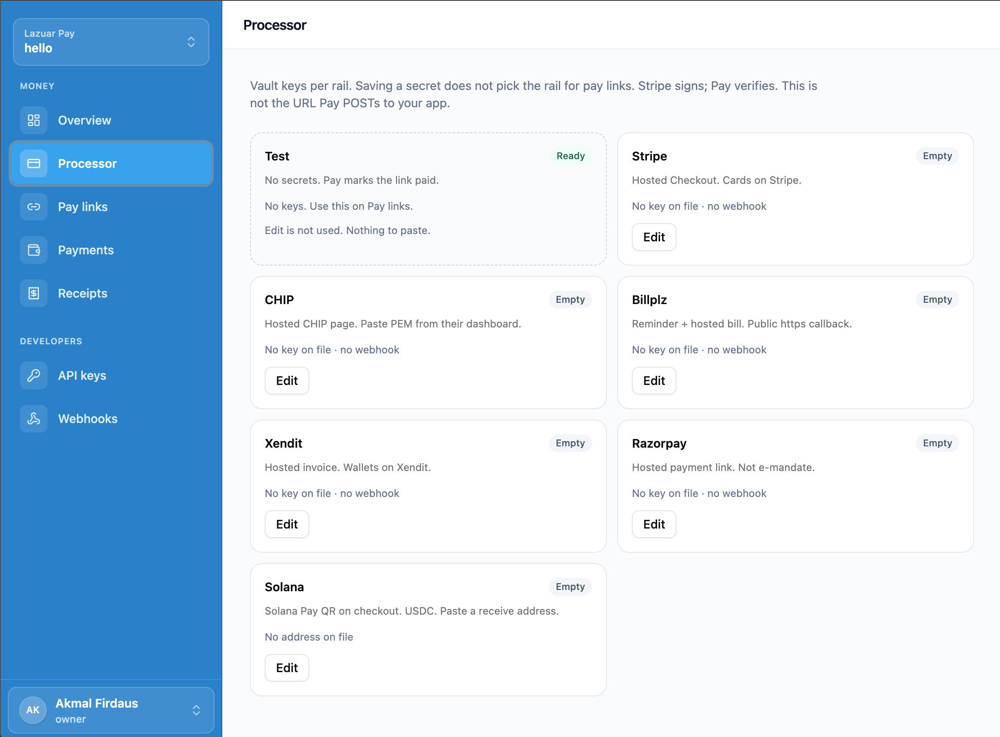

# Lazuar Pay

Checkout-as-a-service for **other apps**. Your frontend stays yours. Pay mints a hosted link, takes the money, books an Official Receipt, and POSTs a signed webhook. Identity is sibling **lazuar-one** (private).

Built by [Akmal Firdaus](https://x.com/akmalfirdxus) — solo, Malaysia.



**Focused Pay** (this repo’s cashier) is `apps/lazuar-pay` on **8081**, merchant **:5178**, checkout **:5179**. One API is **8080**.

Integrators: [`apps/lazuar-pay/README.md`](apps/lazuar-pay/README.md) and [`examples/pay-node`](examples/pay-node).

## For app developers

A second app does not pick a PSP, import a wallet SDK, or talk to Stripe/Solana directly.

1. Mint a One workspace key (`lzr_sk_`) with `tenant:read` + `authz:check` — Pay merchant **Developers → API keys**, or One Settings. Shown once. Never `VITE_*`.
2. `PUT /v1/orgs/{orgId}/webhooks` with the HTTPS URL Pay will POST to. Copy `whsec_` once. Verify `X-Lazuar-Signature`.
3. `POST /v1/orgs/{orgId}/payment-links` (or `/v1/checkouts`) with `provider` and amount. Send `Authorization: Bearer lzr_sk_…`.
4. Send the buyer `pay_url` (`{CheckoutBaseUrl}/c/{token}`).
5. Unlock on Plane C `payment.completed` (also `payment.failed` / `checkout.expired` / `refund.created` when those writers run).

`$ORG_ID` is the One tenant id. The merchant SPA still uses a human JWT only. Pay does not mint `lzr_sk_` and does not mint Hub/Stripe `sk_`. Sample: `examples/pay-node` (port **3021**).

## One contract across rails

Integrate PSPs directly and the surface grows **O(rails)** — every rail is a project. Behind Pay it is **O(1)** — every rail is a string.

Direct integration means building the same layers each PSP's way:

| Layer | Stripe | Billplz | CHIP | Xendit | Razorpay | Solana (direct) |
|-------|--------|---------|------|--------|----------|-----------------|
| Auth | Bearer `sk_` | Basic auth | API key + RSA PEM | Bearer + callback token | key_id/secret | — |
| Callback verify | SDK signature | `x_signature` HMAC | RSA-2048 PEM | token SHA256 | HMAC | poll RPC yourself |
| Refunds | API | — | API | API | API | impossible on-chain |
| Receipts / ledger | — | — | — | — | — | — |

Five rails ≈ five webhook verifiers, five state machines, five dashboards to reconcile — and "accept USDC" done directly is the *worst* project of the six (wallets, RPC, finality, reorgs). That is why merchants hand crypto to a custody processor and inherit float, payout schedules, and freeze risk.

Pay collapses all of it into four ones:

1. **One mint endpoint.** A checkout is `POST /v1/orgs/{orgId}/checkouts` with `provider` + `amount` (+ `currency`). The rail is data, not code. Pay fails at mint if the provider has no keys on file — not at payment time.
2. **One `pay_url`.** Every rail resolves to `{CheckoutBaseUrl}/c/{token}`. What is behind it — Billplz bill, Stripe Checkout, Solana Pay QR — is Pay's problem. The integrating app never imports a wallet SDK; grep a client app and you will not find the word "wallet".
3. **One signed webhook.** The same Plane C events for every rail (`payment.completed` / `payment.failed` / `checkout.expired` / `refund.created`), HMAC'd with one `whsec_`, replay-deduped. "Unlock the order" is written once. PSP ambiguity — timeout after send, duplicate events, out-of-order refunds — is Pay's bug class (`issues/001`), not the merchant's.
4. **One receipt, one ledger.** RM9.90 via FPX and 10 USDC on Solana both book an `RCPT-…` and the same two-line journal. Refunds: one API on Stripe/CHIP/Xendit/Razorpay — and on Solana, where a chain refund is physically impossible, the contract says so honestly.

The two consequences:

- **For a merchant:** adding a rail is a settings page, not a sprint. Paste CHIP's PEM, change `provider` to `"chip"`. Same app can route per checkout — FPX for one buyer, USDC for the next.
- **For the platform:** adding a rail to the product is one more row in Pay's rails table. Every existing integrator wakes up with a new capability and zero migration.

Crypto processors sell "accept crypto" through their custody. Pay sells checkout where crypto is a row — receive-only, funds land on the merchant's own address, no processor in the money path.

## Rails

| Provider | Today | Buyer |
|----------|--------|--------|
| `test` | Dev/Testing. No secrets. Pay marks the link paid. | Hosted `:5179` |
| `stripe` | Hosted Checkout. Cards on Stripe. | Stripe page |
| `chip` | Hosted CHIP (FPX/wallets if enabled on the brand). Paste PEM. | CHIP page |
| `billplz` | Hosted bill. Public **https** callback. | Billplz page |
| `xendit` | Hosted invoice. | Xendit page |
| `razorpay` | Hosted payment link. Not e-mandate. | Razorpay page |
| **`solana`** | Solana Pay QR, USDC only. Same mint / `pay_url` / HMAC as the rows above. The integrating app still does not import a wallet SDK. Production needs `Pay__Solana__Cluster=mainnet-beta` and a paid HTTPS RPC. | Checkout QR |

Saving a vault does **not** pick a default rail. Mint with an explicit `provider` that already has keys. Occupancy (how many people can start Pay) is a pay-link field, not a rail. Buyers have no One account.

**Honest capability today:** BYOK hosted PSP links + Test, Official Receipt `RCPT-…` (not a MyInvois tax invoice), two-line journal, Plane C HMAC to your app. No proven sandbox MyInvois `VALID`. No FPX e-mandate. No Bitcoin. No Pay.sh / x402 agent CLI.

## Ports

| Process | Port | Job |
|---------|------|-----|
| One API | 8080 | Identity. Not Pay. Fingerprint: `GET /api/v1/` names `lazuar-one-api`. |
| Pay | **8081** | Money host |
| One login | 5175 | Staff sign-in |
| One app | 5174 | Workspace, full API-key catalog |
| Pay merchant | **5178** | Processor, pay links, Developers (API keys + webhooks) |
| Pay checkout | **5179** | Buyer `/c/{token}` |
| `examples/pay-node` | 3021 | Second-app hatch |
| Pay Postgres | 5435 | `lazuar_pay` |

```bash
task pay:test
task pay:dev          # :8081
task pay:merchant     # :5178
task pay:checkout     # :5179
```

TypeSpec: [`packages/pay-spec`](packages/pay-spec/) (`task pay:spec`). Generated TS: `packages/pay-types-ts`.

Pay images: `docker-compose.pay.yml`. `--profile rust` runs the Rust port on :8095 beside C# :8081 against the same `pay-db` (single replica). Production must set `Pay__CorsOrigins` and `VITE_PAY_API_URL` / `VITE_CHECKOUT_ORIGIN` to public HTTPS.

## Layout

```
apps/lazuar-pay/              focused host (.NET, :8081)
apps/lazuar-api/              sync Rust port (:8095 until cutover)
apps/lazuar-pay-merchant/     staff SPA (:5178)
apps/lazuar-pay-checkout/     buyer page (:5179)
examples/pay-node/            integrator sample (:3021)
packages/pay-spec/            Pay TypeSpec
packages/pay-types-ts/        generated from pay-spec
```

## Solana Pay (USDC)

`provider=solana` mints a Solana Pay transfer-request QR on the hosted checkout. Receive-only: funds land on the merchant receive address; Pay cannot claw back. Confirm is a reference-key + memo match at `finalized` commitment, then Official Receipt + the same Plane C `payment.completed` HMAC as every other rail. Devnet dogfood and proof signatures: [`apps/lazuar-pay/README.md`](apps/lazuar-pay/README.md).
