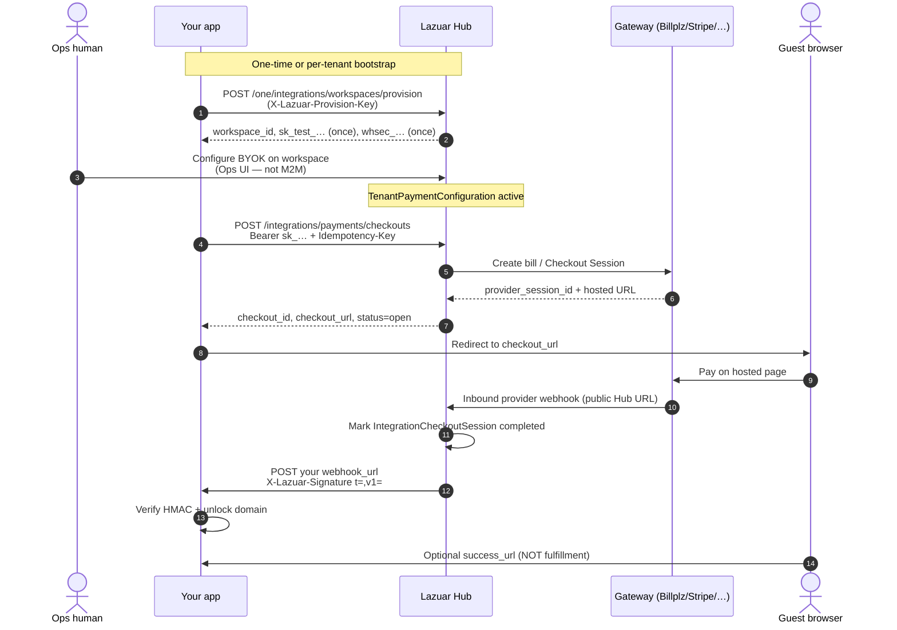
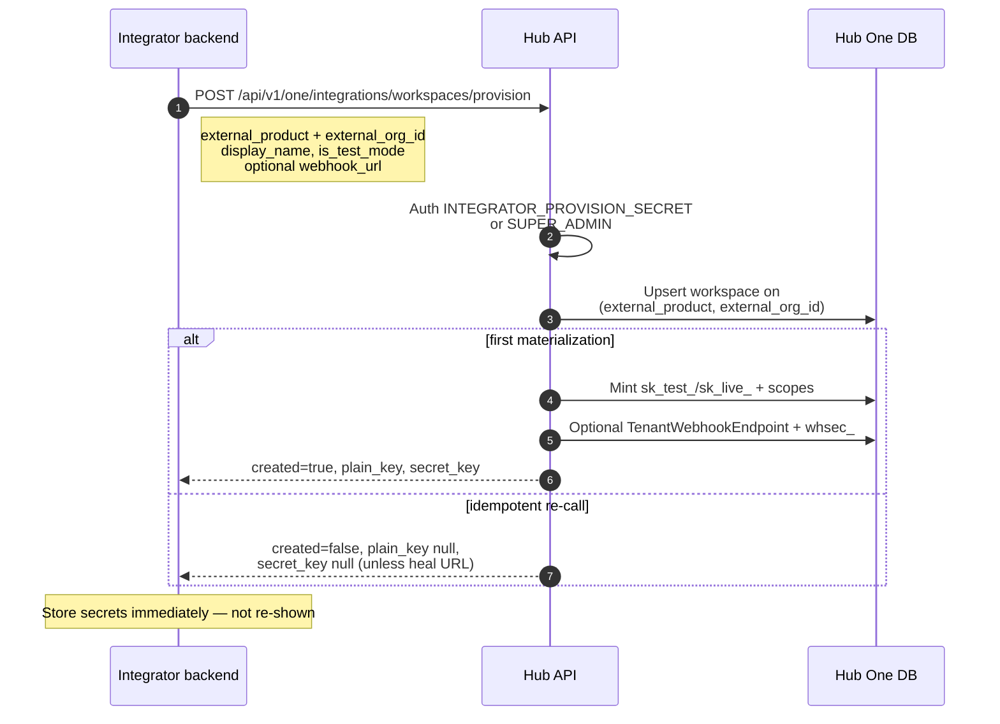
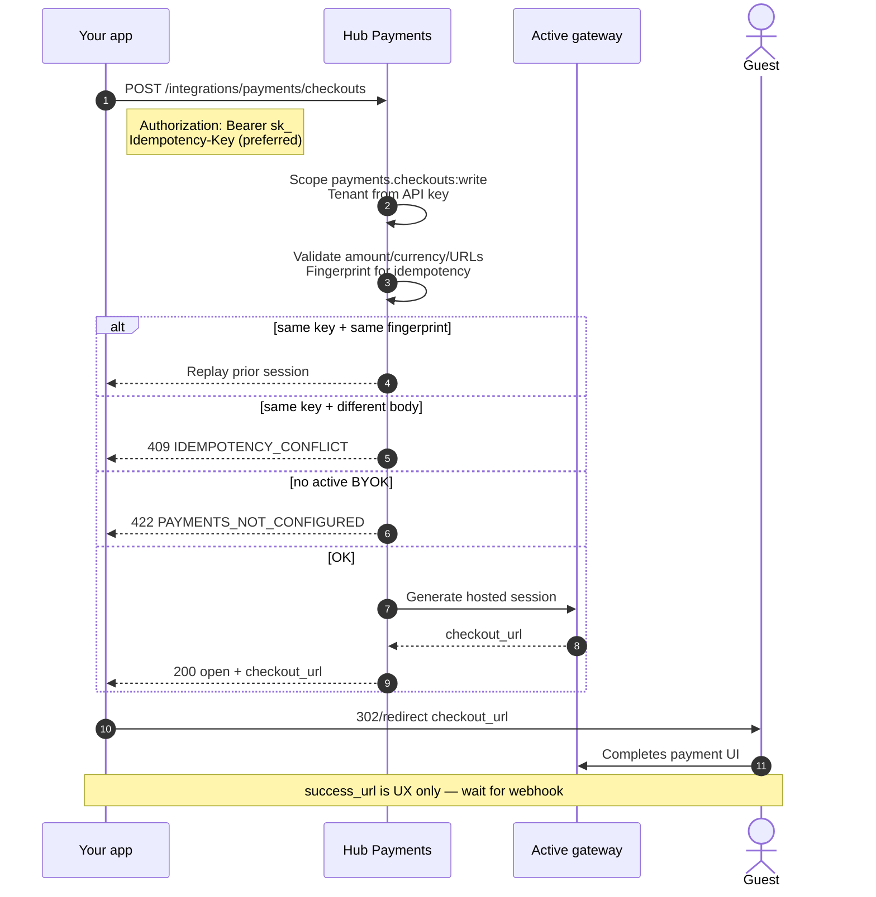
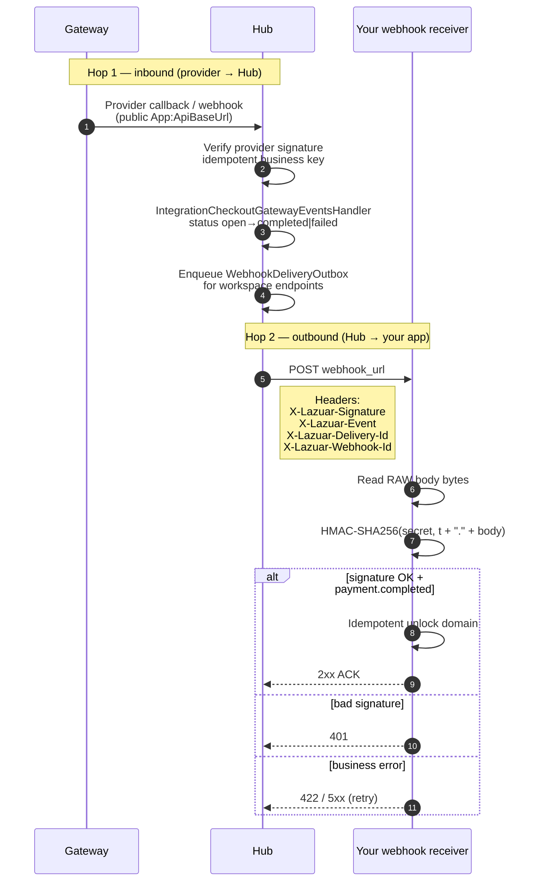
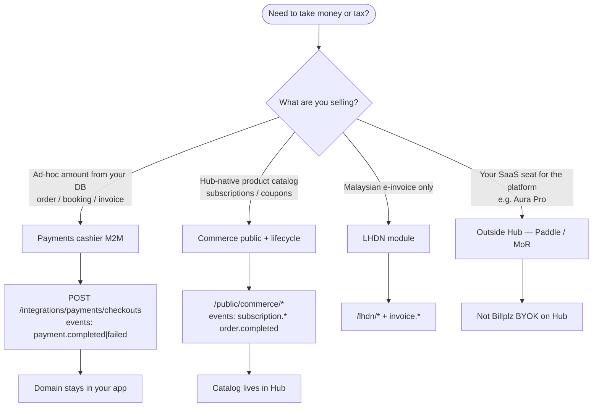
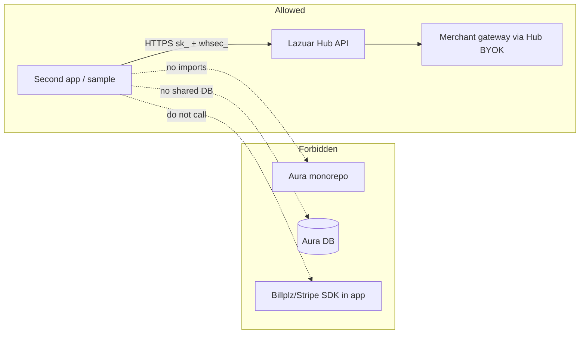
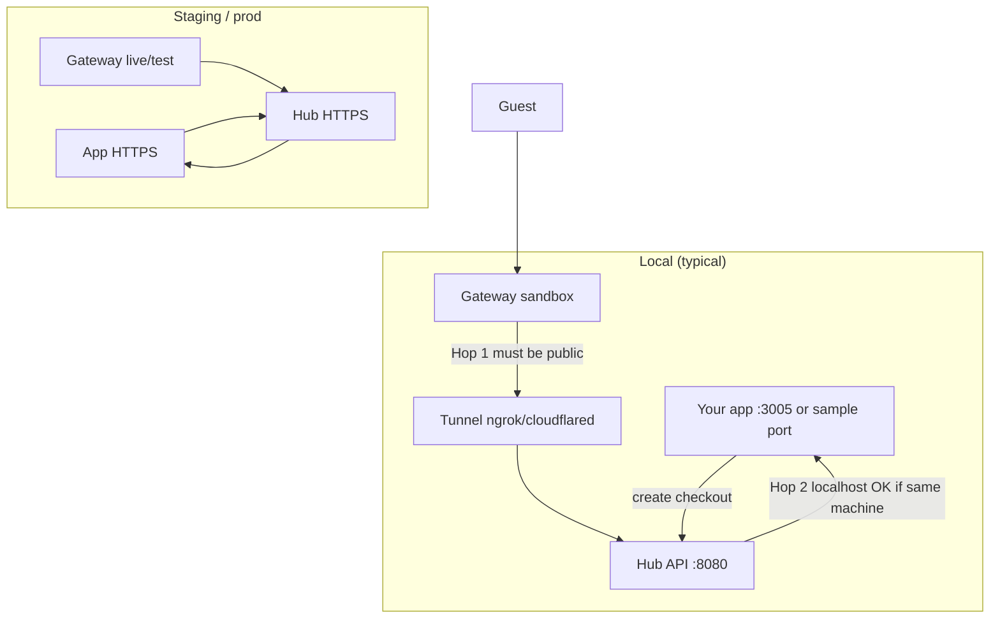
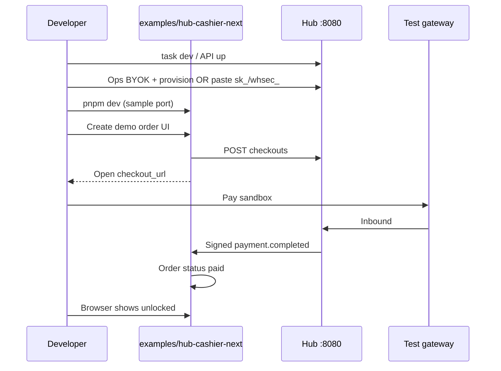

# 01 — Flow diagrams for `apps/lazuar-docs`

**Status:** analysis complete 2026-08-10  
**Goal:** Design complete, paste-ready Mermaid (and intentional ASCII) sources for integrator guides so second-app authors can *see* hops without reading C# or Aura.

---

## 1. Current VitePress structure

### Package

| Item | Value |
|------|--------|
| Package name | `lazuar-docs` |
| Path | `/Users/akmalfirdaus/Code/lazuar/lazuar-pay/apps/lazuar-docs` |
| Dev | `pnpm --filter lazuar-docs dev` → `http://localhost:5180` |
| Config | `docs/.vitepress/config.ts` |
| Markdown root | `docs/` |
| Mermaid support | **Not enabled yet** — VitePress 1.6.x supports Mermaid via `markdown.theme` plugins or community `vitepress-plugin-mermaid` / built-in fence if configured |

### Existing pages (no Mermaid today)

```text
apps/lazuar-docs/docs/
  index.md                          # home
  guide/
    product-lines.md                # table only
    concepts.md
    how-to-maintain.md
  integrations/
    index.md                        # ASCII E2E only
    payments-cashier.md
    provision.md
    create-checkout.md
    webhooks.md
    api-keys.md
    environments.md                 # text hops
    aura-reference.md
    second-app-checklist.md
  reference/
    error-codes.md
    events.md
    openapi.md
    glossary.md
  .vitepress/config.ts
  public/favicon.svg
```

`integrations/index.md` already has a compact **ASCII** sequence diagram. That is a good fallback pattern; Mermaid should *upgrade* it, not remove text alternative.

---

## 2. Mermaid vs ASCII decision matrix

| Diagram | Prefer | Why |
|---------|--------|-----|
| E2E cashier (multi-party) | **Mermaid `sequenceDiagram`** + ASCII below for a11y | Core story; sequence is natural |
| Provision | Mermaid sequence | Request/response + secret once |
| Create checkout | Mermaid sequence | Idempotency + redirect |
| Webhook hops (2 legs) | Mermaid sequence | Inbound vs outbound often confused |
| Product lines | Mermaid `flowchart TB` | Decision tree |
| Second-app independence | Mermaid flowchart | Prove no Aura |
| Environments / tunnels | Mermaid flowchart **or** keep ASCII table | Network topology can get noisy in Mermaid |
| Responsibility (who does what) | **Tables (M1–M7)** not diagrams | See `02-responsibility-matrices.md` |
| Error mapping | Table only | Codes are tabular |

### Enabling Mermaid in VitePress

**Recommended approach (minimal):**

```ts
// docs/.vitepress/config.ts (illustrative)
import { defineConfig } from "vitepress";
import { withMermaid } from "vitepress-plugin-mermaid";

export default withMermaid(
  defineConfig({
    // …existing themeConfig…
    mermaid: {
      // keep theme readable on dark/light
      theme: "neutral",
    },
  }),
);
```

Add devDependency `vitepress-plugin-mermaid` + `mermaid` to `apps/lazuar-docs/package.json`.

**Fallback if plugin friction:** ship **fenced ASCII** diagrams only (already works). Do not block D02 on plugin if build breaks CI docs job.

**Build check:** `pnpm --filter lazuar-docs build` must succeed; Mermaid is compile-time transformed to SVG/HTML in plugin setups.

---

## 3. Which pages need which diagrams

| Page path | Diagram ID | Title | Placement on page |
|-----------|------------|-------|-------------------|
| `integrations/index.md` | D-E2E | End-to-end Payments cashier | Replace/upgrade existing ASCII; keep ASCII under Mermaid |
| `integrations/provision.md` | D-PROV | Provision workspace | After “Endpoint”, before field notes |
| `integrations/create-checkout.md` | D-CHK | Create + redirect | After “Endpoint” |
| `integrations/webhooks.md` | D-WH | Dual webhook hops + verify | Top after intro; second small diagram for verify steps |
| `integrations/environments.md` | D-ENV | Public URL hops | After intro paragraph |
| `guide/product-lines.md` | D-PL | Choose product | After intro table |
| `integrations/second-app-checklist.md` | D-2ND | Independence boundary | After Goal |
| `integrations/payments-cashier.md` | D-E2E (link) | Same as index or embed compact | “End-to-end in one page” section |
| **New** `guide/architecture-who-does-what.md` | optional tiny | Point to matrices | See 02, 08 |
| **New** `guide/payment-flow.md` | D-E2E + D-WH | Narrative walkthrough | Dedicated flow page (08) |
| **New** `integrations/run-sample-app.md` | D-SAMPLE | Sample app sequence | After install |

Pages that **do not** need diagrams: `api-keys.md` (table), `error-codes.md`, `events.md`, `openapi.md`, `glossary.md`, `how-to-maintain.md`, `aura-reference.md` (mapping table is enough).

---

## 4. Full Mermaid sources

Conventions for all diagrams:

- Actor names match docs glossary: **Your app**, **Hub**, **Gateway**, **Guest**, **Ops human**.
- Prefer product-neutral “Your app” over “Aura”.
- Labels use real path fragments: `/integrations/payments/checkouts`, `payment.completed`.
- No secrets in diagram labels.

### 4.1 D-E2E — End-to-end cashier

**File:** `integrations/index.md`, `integrations/payments-cashier.md`, `guide/payment-flow.md`

````markdown

````

**ASCII twin (keep for a11y / copy-paste):**

```text
Your app                  Lazuar Hub                 Gateway
   |                          |                         |
   |-- provision workspace -->|                         |
   |<-- sk_ + whsec_ ---------|                         |
   |                          |<-- human BYOK config ---|
   |-- create checkout ------>|                         |
   |<-- checkout_url ---------|-- create bill/session ->|
   |-- redirect guest --------|------------------------>|
   |                          |<-- provider webhook ----|
   |<-- payment.completed ----|                         |
   |-- unlock domain ---------|                         |
```

---

### 4.2 D-PROV — Provision

**File:** `integrations/provision.md`

````markdown

````

---

### 4.3 D-CHK — Create checkout + redirect

**File:** `integrations/create-checkout.md`

````markdown

````

---

### 4.4 D-WH — Dual hops + signature verify

**File:** `integrations/webhooks.md`, `guide/payment-flow.md`

**Hop diagram:**

````markdown

````

**Verify flowchart (optional second):**

````markdown
```mermaid
flowchart TD
  A[Receive POST] --> B[Buffer raw body UTF-8]
  B --> C[Parse X-Lazuar-Signature t and v1]
  C --> D{|now - t| ≤ 300s?}
  D -->|no| R1[Reject 401]
  D -->|yes| E["signed = t + '.' + body"]
  E --> F[HMAC-SHA256 hex lower]
  F --> G{constant-time eq v1?}
  G -->|no| R1
  G -->|yes| H[Parse JSON envelope]
  H --> I{event_type / data.status}
  I -->|payment.completed| J[Fulfill once]
  I -->|payment.failed| K[Mark failed / no unlock]
  J --> L[200 OK]
  K --> L
```
````

---

### 4.5 D-PL — Product lines decision

**File:** `guide/product-lines.md`

````markdown

````

---

### 4.6 D-2ND — Second-app independence

**File:** `integrations/second-app-checklist.md`

````markdown

````

---

### 4.7 D-ENV — Environments & public URLs

**File:** `integrations/environments.md`

````markdown

````

**Table twin (already on page — keep):**

| Hop | Config | Local example |
|-----|--------|---------------|
| Hub API public | `App:ApiBaseUrl` | Tunnel → `https://…/api/v1` |
| Your webhook | provision `webhook_url` | `http://127.0.0.1:…/api/webhooks/hub` or tunnel |

---

### 4.8 D-SAMPLE — Sample app (run guide)

**File:** new `integrations/run-sample-app.md`

````markdown

````

---

## 5. File paths summary (implementation checklist)

| Action | Path |
|--------|------|
| Enable Mermaid | `apps/lazuar-docs/package.json`, `docs/.vitepress/config.ts` |
| E2E | `docs/integrations/index.md`, `docs/integrations/payments-cashier.md` |
| Provision | `docs/integrations/provision.md` |
| Checkout | `docs/integrations/create-checkout.md` |
| Webhooks | `docs/integrations/webhooks.md` |
| Environments | `docs/integrations/environments.md` |
| Product lines | `docs/guide/product-lines.md` |
| Second app | `docs/integrations/second-app-checklist.md` |
| New flow narrative | `docs/guide/payment-flow.md` (08) |
| Run sample | `docs/integrations/run-sample-app.md` (08) |
| Maintain note | `docs/guide/how-to-maintain.md` — add “diagrams must match IntegrationEndpoints + OutboundWebhook*” |

---

## 6. Accessibility & maintenance

### 6.1 Accessibility

1. **Never Mermaid-only.** Immediately under each diagram, include:
   - Short prose summary (2–4 sentences), **or**
   - ASCII twin, **or**
   - Bullet list of steps.
2. Alt text is weak for sequence diagrams; prose is the a11y channel.
3. Avoid color-only meaning in flowcharts (use labels).
4. Prefer high-contrast Mermaid theme (`neutral` / `base`).
5. Keep node labels short; wrap with `<br/>` rather than microscopic font.

### 6.2 Maintenance rules

| Rule | Detail |
|------|--------|
| Same PR as API change | If path/header/event renames, update diagram labels in same PR |
| SSoT paths | Comment HTML in MD: `<!-- source: IntegrationEndpoints.cs -->` |
| No secrets | Never draw real sk_/whsec_ |
| Port discipline | Document API as **8080** (canonical). Mention historical 8090 in environments only as “docs may still say 8090; prefer 8080” |
| Envelope honesty | Webhook diagrams must show **envelope** (`id`, `event_type`, `data`) per `OutboundWebhookEventHandlers` |
| Review cadence | When adding gateways, only change D-E2E “Gateway” label if needed — adapters are Hub-internal |

### 6.3 Anti-patterns

- Diagrams that show Your app calling Billplz directly.
- Diagrams that mark `success_url` as fulfillment.
- Mixing Commerce subscription events into Payments cashier sequence.
- Using Aura-specific actor names as the only sample.

---

## 7. Implementation notes for D02 PR

1. Land Mermaid plugin (or decide ASCII-only) in a **docs-only** PR first if risk of build break.  
2. Paste D-E2E + D-WH first (highest confusion).  
3. Add D-PROV, D-CHK, D-PL, D-ENV, D-2ND.  
4. Screenshot or local visual check light + dark.  
5. Cross-link from homepage “Start here” to payment-flow page once it exists.

---

## 8. Verification

- [ ] `pnpm --filter lazuar-docs build` green  
- [ ] Each diagram page still readable with CSS disabled (prose/ASCII present)  
- [ ] Labels match `packages/api-spec` paths and `OutboundWebhookDispatcherJob` headers  
- [ ] Second-app checklist diagram does not imply Aura dependency  
