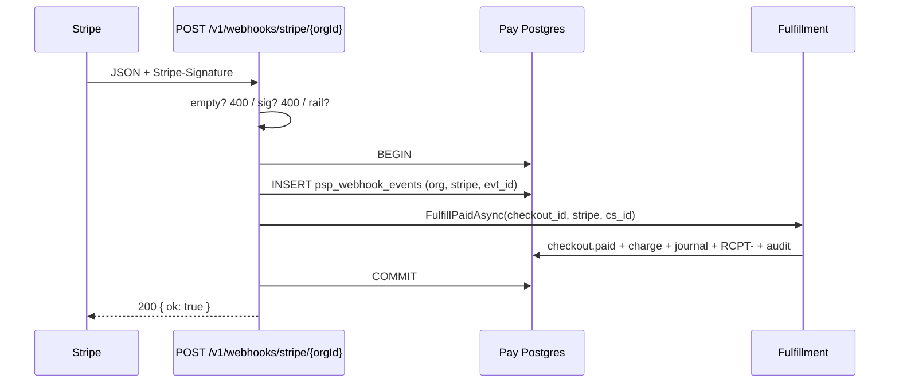
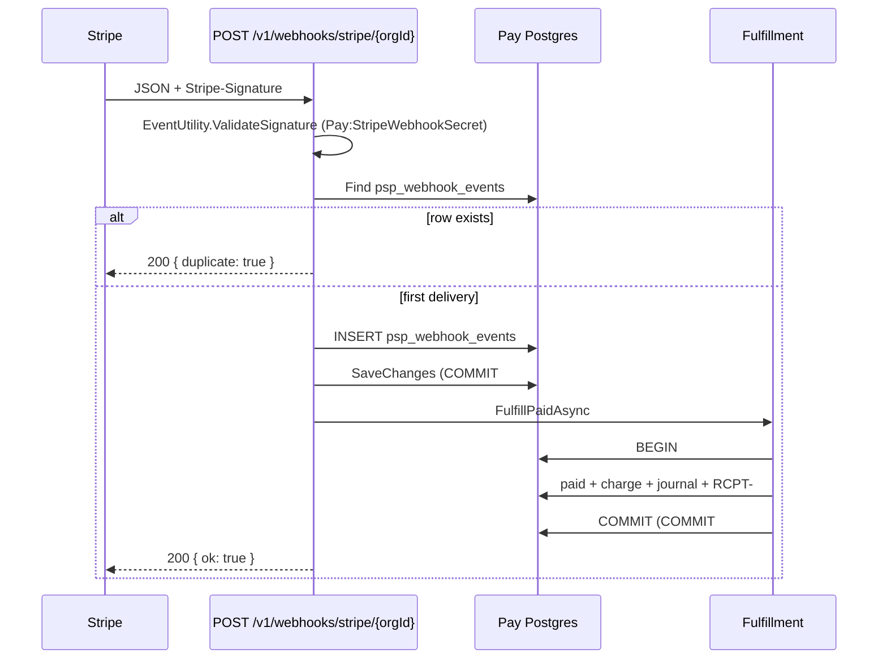
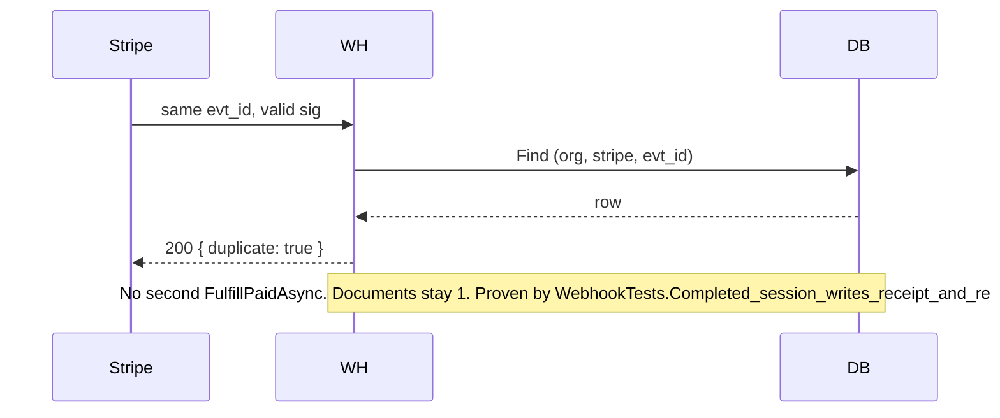
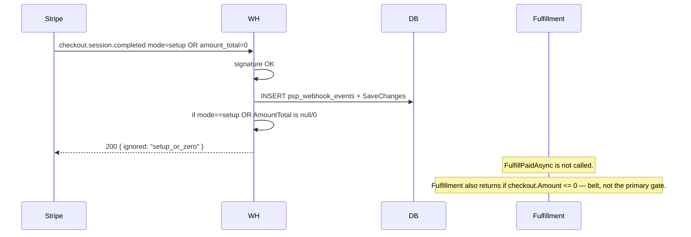

# 08 — Webhooks, secrets, fulfillment (the money-safety paper)

**Family:** 014-evals  
**Paper:** 08 — Plane B + secrets + same-handler fulfillment  
**Date:** 24 August 2026  
**Type:** Uncondensed evaluation. **Not an implementation.** **Not** a flip of [011/11](../011-new-lazuar-pay/11-checklist.md) cells. **Not** a project reference into `apps/lazuar-api`.

| | |
|--|--|
| Repo | `/Users/akmalfirdaus/Code/lazuar/lazuar-pay` |
| Branch | `main` |
| HEAD | `ee2db8e5` — `feat(pay): Bar B receipts, webhook secret, merchant money UI` |
| Full SHA | `ee2db8e5758305089a38298456c456d6bf0e97ca` |

Parent index: [README.md](./README.md). Binding from [011](../011-new-lazuar-pay/README.md), [012/09](../012-one-to-pay/09-webhooks-events.md), [013/06](../013-prods/06-money-rails.md), [013/07](../013-prods/07-fulfillment-ledger-docs.md). Live files on this SHA are authority when a ticked 013 checklist disagrees.

This paper’s job: prove (or disprove) that new Pay books money safely. The Hub cashier **verified then published**. New Pay was supposed to **verify, insert the idempotency row, and fulfill in one Pay DB transaction**. The files on `ee2db8e5` do call `Fulfillment` from the webhook HTTP handler. They do **not** share one transaction. The webhook signing secret is a **platform** env var. Those two facts are the money-safety verdict.

---

## 0. How to read this paper

Three webhook stories. Mixing them is how Hub ended up with an in-process catalog talking to itself **and** a public HMAC door **and** Stripe/CHIP/Billplz callbacks, all called “webhooks.”

| Plane | Direction | Auth | Table | Job on this SHA |
|-------|-----------|------|-------|-----------------|
| **A. One → Pay** | One POSTs signed JSON to Pay | HMAC (`whsec_…`), not Bearer, not Stripe-Signature | `one_webhook_events` | `tenant.suspended` → `org_settings.charges_paused`. Membership is **not** applied. |
| **B. PSP → Pay** | Stripe (only) POSTs to Pay | Provider signature (`Stripe-Signature`) | `psp_webhook_events` | This paper’s core. Verify, unique `(org_id, provider, event_id)`, then `Fulfillment.FulfillPaidAsync`. |
| **C. Pay → merchant** | Pay POSTs to a stranger | Later | none | Not v1. Hub outbound (`OutboundWebhookDispatcherJob`, `OutboundWebhookSignature`) is museum. |

Do not share a table, a secret, or a route prefix. Do not verify Stripe with `Pay:OneWebhookSecret`. Do not verify One with `Pay:StripeWebhookSecret`. Do not wait for One to “hear” a charge before writing money.

**Same-handler standing law** ([013/06](../013-prods/06-money-rails.md) §0, [013/07](../013-prods/07-fulfillment-ledger-docs.md) Binding #1, `NP-FUL-001`):

> On the new host that means: `POST /v1/webhooks/{provider}/{orgId}` verifies, inserts the idempotency row, **then calls the fulfillment function in-process** (journal + `RCPT-` + session `paid`) in **one Pay DB transaction**. It does **not** `PublishAsync` a `GatewayPaymentCompletedIntegrationEvent`.

**HTTP standing law** ([013/06](../013-prods/06-money-rails.md) §5.5): empty body **400**. Invalid signature **400**. Retry no-op **200** `{ duplicate: true }`. Never 401 on Plane B (there is no Bearer). Never treat setup as paid (`NP-GW-008`).

**Authz standing law:** VIEWER is not a One role. `member` cannot paste keys. PUT keys = writer (`owner`/`admin`). GET hints = member.

**Secrets standing law:** ASP.NET DataProtection / a Pay secret box vs Hub `AesSecretVault`. Per-org ciphertext. Missing wrap key refuses boot or save. `DecryptOrPlaintext` is a Hub crutch — do not import it. The question this paper must answer: **is `Pay:StripeWebhookSecret` a platform hole in BYOK?**

Yes. Section 8.

---

## 1. Method / files actually opened

### New Pay (`apps/lazuar-pay`)

| Path | Role |
|------|------|
| `src/Lazuar.Pay/Gateways/WebhookEndpoints.cs` | Entire Plane B handler. Quoted in §4. |
| `src/Lazuar.Pay/Gateways/GatewayEndpoints.cs` | PUT/GET BYOK `sk_`. Writer vs member. |
| `src/Lazuar.Pay/Gateways/StripeHosted.cs` | Hosted Checkout `mode=payment`. Decrypts per-org `sk_`. |
| `src/Lazuar.Pay/Secrets/SecretBox.cs` | AES-GCM wrap. `Pay:WrapKey`. Dev SHA-256 fallback. |
| `src/Lazuar.Pay/Money/Fulfillment.cs` | Entire fulfill function. Quoted in §6. |
| `src/Lazuar.Pay/Money/PaymentQueryEndpoints.cs` | Member-gated payments/receipts GET. |
| `src/Lazuar.Pay/Data/PayDbContext.cs` | One context. Unique keys. |
| `src/Lazuar.Pay/Data/Rows.cs` | Credential, PSP event, One event, journal, documents. |
| `src/Lazuar.Pay/Data/Migrations/20260821152601_Initial.cs` | Schema as migrated. |
| `src/Lazuar.Pay/One/OneWebhookEndpoints.cs` | Plane A. Namespace `Lazuar.Pay.Webhooks`. |
| `src/Lazuar.Pay/One/MemberGate.cs` | `RequireMemberAsync` / `RequireWriterAsync`. |
| `src/Lazuar.Pay/One/OneAuthz.cs` | Authz DTO only. |
| `src/Lazuar.Pay/One/OneClient.cs` | `authz/check` relation is **always** `member`. |
| `src/Lazuar.Pay/Checkouts/CheckoutEndpoints.cs` | Create seeds `SstRegistered = false`. Respects `ChargesPaused`. |
| `src/Lazuar.Pay/PublicPay/PublicPayEndpoints.cs` | Buyer start respects `ChargesPaused`. Empty-body test lives next to this. |
| `src/Lazuar.Pay/Program.cs` | `AddDataProtection()` unused by `SecretBox`. Maps both webhook doors. |
| `tests/Lazuar.Pay.Tests/WebhookTests.cs` | Three Plane B tests. |
| `tests/Lazuar.Pay.Tests/PublicPayTests.cs` | `Empty_webhook_is_400`. |
| `tests/Lazuar.Pay.Tests/PayApiFactory.cs` | Fixture `Pay:StripeWebhookSecret`. InMemory. |
| `tests/Lazuar.Pay.Tests/CatalogTests.cs` | `member` cannot create product — **not** keys. |
| `tests/Lazuar.Pay.Tests/IsolationTests.cs` | Bans MediatR / BuildingBlocks / Hub. |
| `packages/pay-spec/main.tsp` | Both webhook routes exist as `{ ok: boolean }`. |

### Hub (`apps/lazuar-api`)

| Path | Role |
|------|------|
| `Modules/Payments/Infrastructure/Endpoints.cs` | `POST /webhooks/payments/{gatewayType}/{tenantId}`. Empty 400. Query-* injection. |
| `Modules/Payments/Application/Commands/ProcessGatewayWebhookCommandHandler.cs` | Verify → filter → log → **PublishAsync**. |
| `…Handler.Idempotency.cs` | Business key + 23505 swallow. |
| `…Handler.Logging.cs` | “received and queued. Not Commerce / Billing / session fulfillment.” |
| `…Handler.Metadata.cs` | Billplz session merge. Fail-open on lookup error. |
| `Modules/Payments/Domain/Entities/PaymentWebhookLog.cs` | Event log + outbox correlation. |
| `Modules/Payments/Infrastructure/Configurations/PaymentConfigurations.cs` | Unique `(OrganizationId, Provider, EventId)` + business-key unique. |
| `Modules/Payments/Infrastructure/Migrations/20260627124811_InitialPaymentsSchema.cs` | Original unique `(Provider, EventId)` — **not tenant-scoped**. |
| `Modules/Payments/Infrastructure/Migrations/20260822120000_AddPaymentWebhookOrganizationId.cs` | Live unique is tenant-scoped. |
| `BuildingBlocks/Infrastructure/AesSecretVault.cs` | AES-256-CBC. `Kms:MasterKey` then `Jwt:Secret`. PadRight 32 with `'0'`. |
| `BuildingBlocks/Application/SecretVaultExtensions.cs` | `DecryptOrPlaintext` swallows crypto failure. |
| `Modules/Payments/Infrastructure/EventHandlers/IntegrationCheckoutGatewayEventsHandler.cs` | M2M session + outbound `payment.completed`. |
| `Modules/Payments/Infrastructure/EventHandlers/ExecuteOffSessionChargeIntegrationEventHandler.cs` | Success is a later webhook. |
| `Modules/Payments/Infrastructure/EventHandlers/GatewayRefundRequestedIntegrationEventHandler.cs` | API refund path; publishes Completed on adapter bool. |
| `Modules/Payments/Infrastructure/Gateways/StripeGatewayAdapter.cs` | Setup as `PAYMENT_COMPLETED` $0. Disputes. Refunds. `payment_intent.payment_failed`. |
| `Modules/One/Infrastructure/Workers/OutboundWebhookSignature.cs` | Plane C museum. `t=…,v1=…` over `{ts}.{body}`. |
| `tests/Lazuar.ModuleTests/Payments/ProcessGatewayWebhookCommandHandlerTests.cs` | Handler tests exist **now** (docs/001-gaps/02 is stale on “no tests”). |

### Docs / plans

- `docs/001-gaps/02-payment-webhooks.md` (Hub museum; EventId uniqueness and PAYMENT_FAILED claims are **stale** vs live handler).
- `docs/architecture-decision-log/009-stateless-webhook-metadata-transmission.md` (Billplz query-string context).
- `apps/lazuar-api/docs/006-payment-webhook-idempotency-backfilling.md` (still documents the **old** unique `(Provider, EventId)`).
- `plans/012-one-to-pay/09-webhooks-events.md` — Plane A HMAC contract (`v1=` over `{unix}.{raw_body}`, envelope `tenant_id`, idempotency on event id).
- `plans/013-prods/06-money-rails.md`, `07-fulfillment-ledger-docs.md`.
- `plans/013-prods/checklists/` G11–G25, F10–F22, O14–O17 — **ticked**. Live files and tests do not match every tick. Named in §12.
- `plans/011-new-lazuar-pay/11-checklist.md` — `NP-GW-004/005/006`, `NP-FUL-001`, `NP-ONE-017/018` still **todo**. This eval does not flip them.

---

## 2. The three planes, as wired on `ee2db8e5`

`Program.cs` maps both doors and does not share code between them:

```46:68:apps/lazuar-pay/src/Lazuar.Pay/Program.cs
app.MapGet("/health", () => Results.Ok(new { status = "ok" }));
app.MapGet("/v1/health", () => Results.Ok(new { status = "ok" }));
// ...
app.MapWhoami();
app.MapOrgReady();
app.MapCheckouts();
app.MapCatalog();
app.MapPublicPay();
app.MapGateways();
app.MapWebhooks();
app.MapPaymentQueries();
app.MapOneWebhooks();
```

pay-spec names both under `/v1`:

```144:154:packages/pay-spec/main.tsp
@route("/v1")
@tag("Webhooks")
interface Webhooks {
  @post
  @route("/webhooks/{provider}/{orgId}")
  psp(@path provider: string, @path orgId: string): { ok: boolean };

  @post
  @route("/one/webhooks")
  one(): { ok: boolean };
}
```

IsolationTests still ban `MediatR`, `BuildingBlocks`, `Modules.One`. The new host does **not** `PublishAsync` `GatewayPaymentCompletedIntegrationEvent`. That half of the standing law holds. The “one Pay DB transaction” half does not. Isolation is not money safety.

Hub Plane B remains the cathedral this host refused to copy:

```23:75:apps/lazuar-api/Modules/Payments/Infrastructure/Endpoints.cs
        var group = endpoints.MapGroup("/webhooks/payments");

        group.MapPost("/{gatewayType}/{tenantId:guid}", async (
            string gatewayType,
            Guid tenantId,
            HttpContext context,
            IMediator mediator,
            ILoggerFactory loggerFactory) =>
        {
            // ...
            if (string.IsNullOrWhiteSpace(rawBody))
            {
                // Health checks / empty retries must not 500 (B04-P18).
                return Results.BadRequest(new { error = "Empty request body." });
            }
            // headers + Query-* (ADR-009)
            await mediator.Send(command);
            // Intake ACK only. Domain fulfillment lives in Commerce / Billing / M2M session.
            return Results.Ok(new { received = true });
        });
```

New Pay path is `/v1/webhooks/{provider}/{orgId}` on **8081**. Not `/api/v1`. Not `/webhooks/payments`. Not a Guid constraint on `orgId` (One tenant ids are strings in Pay). That is the Bezos door `NP-API-002` wanted.

---

## 3. Sequence diagrams (normative)

### 3.1 Plane B happy path (what the law requires vs what the code does)

Law:



Live `WebhookEndpoints.Handle` + `Fulfillment.FulfillPaidAsync`:



Two commits. The unique row is durable **before** money. If commit #2 throws, commit #1 already won. Stripe retries. Retry hits the unique row and returns `{ duplicate: true }` **without** calling fulfill. Buyer paid. Pay has no journal, no `RCPT-`, checkout still `open`. That is the parked-event tax with a unique index as the parking lot.

### 3.2 Duplicate / retry no-op (this part works)



`WebhookTests` posts a signed `checkout.session.completed` twice, asserts one `RCPT-` and balanced debit=credit, then asserts the second body contains `duplicate`. That is `NP-GW-006` for the **happy** path where fulfill already committed. It does not prove the crash-after-insert path.

### 3.3 Setup / zero is not paid



There is **no** hermetic test for this branch on this SHA (G22 and G25.2 tick it; `WebhookTests` does not contain `setup` or `amount_total":0`). The code path exists. CHIP `skip_capture` / `purchase.preauthorized` do not exist — Stripe is the only rail.

### 3.4 One suspend (Plane A, intended)

```mermaid
sequenceDiagram
    participant One
    participant A as POST /v1/one/webhooks
    participant DB
    participant Buyer as POST /v1/pay/{token}/start
    participant Create as POST /v1/checkouts

    One->>A: HMAC JSON type=tenant.suspended tenant_id=…
    A->>A: HMAC verify Pay:OneWebhookSecret
    A->>DB: INSERT one_webhook_events unique DeliveryId
    A->>DB: org_settings.charges_paused = true
    A-->>One: 200 { ok: true }
    Buyer->>Buyer: if ChargesPaused → 403
    Create->>Create: if ChargesPaused → 403
    Note over A: Live HMAC and org_id field do not match sibling One. See §9.
```

Fulfillment does **not** re-check `ChargesPaused`. An in-flight Stripe capture of an already-open checkout still books. That matches O16.3 (“in-flight PSP capture of an already-open attempt may still commit”). New checkouts and public start **do** fail closed — **if** the pause flag was actually set.

---

## 4. Plane B — `WebhookEndpoints.cs` entire

File: `/Users/akmalfirdaus/Code/lazuar/lazuar-pay/apps/lazuar-pay/src/Lazuar.Pay/Gateways/WebhookEndpoints.cs`

```csharp
using System.Text;
using Lazuar.Pay.Data;
using Lazuar.Pay.Money;
using Lazuar.Pay.One;
using Microsoft.EntityFrameworkCore;
using Stripe;

namespace Lazuar.Pay.Gateways;

internal static class WebhookEndpoints
{
    public static void MapWebhooks(this WebApplication app)
    {
        app.MapPost("/v1/webhooks/{provider}/{orgId}", Handle);
    }

    static async Task<IResult> Handle(
        string provider,
        string orgId,
        HttpRequest request,
        PayDbContext db,
        IConfiguration config,
        Fulfillment fulfillment,
        CancellationToken ct)
    {
        if (string.Equals(provider, StripeHosted.Provider, StringComparison.OrdinalIgnoreCase) == false)
        {
            return PayErrors.Status(400, "Bad Request", "unknown provider");
        }

        using var reader = new StreamReader(request.Body, Encoding.UTF8);
        var json = await reader.ReadToEndAsync(ct);
        if (string.IsNullOrWhiteSpace(json))
        {
            return PayErrors.Status(400, "Bad Request", "empty body");
        }

        var configured = await db.GatewayCredentials.AsNoTracking()
            .AnyAsync(x => x.OrgId == orgId && x.Provider == StripeHosted.Provider, ct);
        if (!configured)
        {
            return PayErrors.Status(400, "Bad Request", "rail not configured");
        }

        var whsec = config["Pay:StripeWebhookSecret"];
        if (string.IsNullOrWhiteSpace(whsec))
        {
            return PayErrors.Status(503, "Service Unavailable", "Pay:StripeWebhookSecret missing");
        }

        request.Headers.TryGetValue("Stripe-Signature", out var sig);
        Event stripeEvent;
        try
        {
            EventUtility.ValidateSignature(json, sig.ToString(), whsec);
        }
        catch (StripeException)
        {
            return PayErrors.Status(400, "Bad Request", "invalid signature");
        }

        try
        {
            stripeEvent = EventUtility.ConstructEvent(json, sig.ToString(), whsec, throwOnApiVersionMismatch: false);
        }
        catch (Exception)
        {
            return PayErrors.Status(400, "Bad Request", "invalid event");
        }

        if (await db.PspWebhookEvents.FindAsync([orgId, StripeHosted.Provider, stripeEvent.Id], ct) is not null)
        {
            return Results.Ok(new { duplicate = true });
        }

        db.PspWebhookEvents.Add(new PspWebhookEventRow
        {
            OrgId = orgId,
            Provider = StripeHosted.Provider,
            EventId = stripeEvent.Id,
            ReceivedAt = DateTimeOffset.UtcNow
        });
        await db.SaveChangesAsync(ct);

        if (stripeEvent.Type is "checkout.session.completed")
        {
            if (stripeEvent.Data.Object is Stripe.Checkout.Session session)
            {
                if (session.Mode == "setup" || (session.AmountTotal is null or 0))
                {
                    return Results.Json(new { ignored = "setup_or_zero" }, OneClient.Json);
                }

                var checkoutId = session.ClientReferenceId ?? session.Metadata?["checkout_id"];
                if (!string.IsNullOrWhiteSpace(checkoutId))
                {
                    await fulfillment.FulfillPaidAsync(checkoutId, StripeHosted.Provider, session.Id, ct);
                }
            }
        }

        return Results.Json(new { ok = true }, OneClient.Json);
    }
}
```

Walk, in order, against the standing law.

### 4.1 Provider allow-list

Only `stripe` (`StripeHosted.Provider`). Unknown provider is **400**. CHIP / Billplz / Razorpay / Xendit URLs 400. That is G10 (Stripe first rail). Hub allow-listed five names in `Endpoints.AllowedGatewayTypes`. New Pay does not grow a factory of five on the door.

No Bearer. Signature is the auth. IsolationTests do not care about this route (they care about cathedral types).

### 4.2 Empty body → 400 (`NP-GW-005`)

Whitespace-only body is 400 `"empty body"` **before** signature and **before** the unique insert. Proven by `PublicPayTests.Empty_webhook_is_400` (not `WebhookTests` — the test exists). Hub lives at `Endpoints.cs` empty-body 400 after B04-P18. Steal of the **live** Hub 400, not 008’s 500.

### 4.3 Rail must be configured

`GatewayCredentials` existence for `(orgId, stripe)` is required. Missing → 400 `"rail not configured"`. Soft-disable column does not exist; there is no `IsActive`. Hub still processed webhooks when the gateway was soft-disabled (“credentials retained”). New Pay has nothing to steal yet.

The check is **existence of a BYOK `sk_` row**, not existence of a per-org `whsec_`. The signing secret is not in that table. See §8.

### 4.4 Signature (`NP-GW-004`) — provider SDK, platform secret

`EventUtility.ValidateSignature` then `EventUtility.ConstructEvent(..., throwOnApiVersionMismatch: false)`. Stripe SDK HMAC + timestamp tolerance (~300s). Do not roll your own. Invalid signature is **400**, not 401, not 500. `WebhookTests.Invalid_signature_is_400` covers a deadbeef `v1`.

Missing `Pay:StripeWebhookSecret` is **503** after the rail-configured check. `WebhookTests.Missing_webhook_secret_is_503_when_rail_configured` locks that. 013/06 §5.5 wanted missing org secret → **400** so the PSP stops. 503 is a retry storm. Stripe will retry 5xx. A mis-deployed Pay without the env var will see Stripe hammering until the secret is set, then process a backlog. Prefer 400 if the product intent is “Ada must paste a secret”; prefer 503 only if the product intent is “our platform is down, please retry.” The env var is **platform**, so 503 is at least honest about “Pay is misconfigured,” not “this org is misconfigured.”

The secret used is **not** decrypted from `gateway_credentials`. It is `config["Pay:StripeWebhookSecret"]`. One string for every `{orgId}`. **This is the BYOK hole.** Expanded in §8.

Double verify (`ValidateSignature` then `ConstructEvent`) is redundant, not wrong. `ConstructEvent` is the parse. `throwOnApiVersionMismatch: false` avoids 400s on Stripe API version drift — Hub’s adapter used `ConstructEvent` without that flag (SDK default). Fine for dogfood; pin a version before live.

Raw body is read as UTF-8 string then handed to the SDK. No JSON re-serialize. Correct.

### 4.5 Idempotency insert (`NP-GW-006`) — unique key is right, transaction is wrong

EF composite PK:

```65:69:apps/lazuar-pay/src/Lazuar.Pay/Data/PayDbContext.cs
        model.Entity<PspWebhookEventRow>(e =>
        {
            e.ToTable("psp_webhook_events");
            e.HasKey(x => new { x.OrgId, x.Provider, x.EventId });
        });
```

Migration:

```263:276:apps/lazuar-pay/src/Lazuar.Pay/Data/Migrations/20260821152601_Initial.cs
            migrationBuilder.CreateTable(
                name: "psp_webhook_events",
                schema: "public",
                columns: table => new
                {
                    OrgId = table.Column<string>(type: "text", nullable: false),
                    Provider = table.Column<string>(type: "text", nullable: false),
                    EventId = table.Column<string>(type: "text", nullable: false),
                    ReceivedAt = table.Column<DateTimeOffset>(type: "timestamp with time zone", nullable: false)
                },
                constraints: table =>
                {
                    table.PrimaryKey("PK_psp_webhook_events", x => new { x.OrgId, x.Provider, x.EventId });
                });
```

Row type (`Rows.cs`):

```64:70:apps/lazuar-pay/src/Lazuar.Pay/Data/Rows.cs
public sealed class PspWebhookEventRow
{
    public required string OrgId { get; set; }
    public required string Provider { get; set; }
    public required string EventId { get; set; }
    public DateTimeOffset ReceivedAt { get; set; }
}
```

No payload. No status (`received` vs `applied`). No business key. No outbox id. That is thinner than Hub `PaymentWebhookLog` on purpose — and it is why a committed row with a failed fulfill is **unrecoverable** without an operator deleting the row.

Handler order:

1. `FindAsync([orgId, stripe, stripeEvent.Id])` → duplicate 200.
2. `Add` + `SaveChangesAsync` — **commits**.
3. Maybe fulfill.

No `try/catch` of PostgreSQL `23505`. Two concurrent first deliveries: both `FindAsync` miss; both `Add`; one `SaveChanges` wins; the other throws unique violation → **500**. Hub swallowed 23505 in `TrySaveChangesAsync` and still treated the HTTP as success (after already publishing — Hub’s own race is different; they publish **then** save, so a 23505 after publish is “event may have been queued twice”). New Pay’s race is simpler and currently **uncaught**. Tests use EF InMemory (`PayApiFactory`); InMemory uniqueness is not a substitute for a 23505 test against Npgsql.

No Stripe business key `paid:{pi}`. Only `checkout.session.completed` is fulfilled. `payment_intent.succeeded` is verified, unique-inserted, and **ignored** (`ok: true` without fulfill). That accidentally avoids Hub’s dual-event double-journal **as long as** the completed-session event is the one that carries `client_reference_id`. Off-session later will need `payment_intent.succeeded`. When that lands, two `evt_` ids for one PI will insert two `psp_webhook_events` rows and, if both map to the same checkout, two fulfill attempts. There is no unique on `charges.CheckoutId` or `journal_entries.CheckoutId`. See §6.6.

`EventId` is Stripe `evt_…` (`stripeEvent.Id`). Never a Guid. Good. CHIP `{kind}:{purchaseId}` is not implemented.

URL `orgId` is the first column of the unique tuple. Org A’s `evt_1` does not collide with org B’s `evt_1`. There is **no** test for that (G21.2 ticked “Org A event_id does not collide with org B”). Shared CHIP credentials were the reason Hub added `OrganizationId` to the index. Stripe event ids are globally unique in practice; the tuple is still the right grain.

### 4.6 Event filter — setup not paid, everything else 200

Only `checkout.session.completed` is inspected. Then:

- `session.Mode == "setup"` **or** `AmountTotal is null or 0` → 200 `{ ignored: "setup_or_zero" }`. **Does not call fulfill.** The unique row is already committed. Retries of setup are no-ops. Correct for `NP-GW-008`.
- Else `ClientReferenceId ?? Metadata["checkout_id"]`. If missing, **no fulfill**, 200 `{ ok: true }`, unique row committed. A signed event with no checkout pointer is poison that will never book. StripeHosted **does** set both:

```27:31:apps/lazuar-pay/src/Lazuar.Pay/Gateways/StripeHosted.cs
            Mode = "payment",
            ClientReferenceId = checkout.Id,
            SuccessUrl = checkout.SuccessUrl ?? "http://localhost:5179/c/" + checkout.PublicToken + "?status=verifying",
            CancelUrl = checkout.CancelUrl ?? "http://localhost:5179/c/" + checkout.PublicToken,
            Metadata = new Dictionary<string, string> { ["checkout_id"] = checkout.Id, ["org_id"] = checkout.OrgId },
```

Hosted sessions created by this host round-trip `checkout_id`. Sessions created in the Stripe Dashboard, or PaymentIntents from a later off-session job, will not.

**URL `orgId` is not compared to `session.Metadata["org_id"]` or to `checkout.OrgId`.** Fulfillment loads checkout **by id only**. A correctly signed event (same platform `whsec`) posted to `/v1/webhooks/stripe/{orgB}` whose `client_reference_id` is org A’s checkout will: (1) require org B to have a stripe credential row, (2) insert `(orgB, stripe, evt_id)`, (3) fulfill **org A’s** checkout. With a **platform** webhook secret, any configured org’s URL is a valid door for any Stripe event signed with that secret. Per-org `whsec` would bind verify to that org’s Stripe account; the URL org and the Stripe account would then agree. Today they do not have to.

Unknown event types (including `payment_intent.succeeded`, `charge.refunded`, `charge.dispute.created`, `charge.failed`, `payment_intent.payment_failed`) still insert the unique row and return `{ ok: true }`. Forward compatible. Also: a refund event occupies the unique key and is dropped. When refunds land, those `evt_` ids are already “processed.” Store a status, or only insert on handled kinds, or insert all kinds but fulfill by type inside the same transaction.

No `Query-*` header injection. Billplz is not a rail. ADR-009 is Hub folklore until a reminder rail exists. When Billplz is ported, the callback **must** carry `checkout_id` on the query **and** persist `provider_session_id` = bill id so merge is fallback, not SoT ([013/06](../013-prods/06-money-rails.md)).

No MediatR. No `IEventBus`. No `GatewayPaymentCompletedIntegrationEvent` in `apps/lazuar-pay/src`. Grep of the host source is clean. F10.2 holds.

---

## 5. Unique keys compared (Hub vs Pay)

### 5.1 Hub `payments.PaymentWebhookLogs`

**Born** (2026-06-27) unique on `(Provider, EventId)` **without tenant**:

```103:108:apps/lazuar-api/Modules/Payments/Infrastructure/Migrations/20260627124811_InitialPaymentsSchema.cs
            migrationBuilder.CreateIndex(
                name: "IX_PaymentWebhookLogs_Provider_EventId",
                schema: "payments",
                table: "PaymentWebhookLogs",
                columns: new[] { "Provider", "EventId" },
                unique: true);
```

That was 008’s P0 / 009 B04-P06: shared CHIP/Xendit credentials, two tenants, one provider event id, second tenant dropped as “already processed.”

**Live** (2026-08-22) unique on `(OrganizationId, Provider, EventId)` plus a filtered unique on `(OrganizationId, Provider, BusinessKey)`:

```34:47:apps/lazuar-api/Modules/Payments/Infrastructure/Migrations/20260822120000_AddPaymentWebhookOrganizationId.cs
        migrationBuilder.CreateIndex(
            name: "IX_PaymentWebhookLogs_OrganizationId_Provider_EventId",
            schema: "payments",
            table: "PaymentWebhookLogs",
            columns: new[] { "OrganizationId", "Provider", "EventId" },
            unique: true);

        migrationBuilder.CreateIndex(
            name: "IX_PaymentWebhookLogs_OrganizationId_Provider_BusinessKey",
            schema: "payments",
            table: "PaymentWebhookLogs",
            columns: new[] { "OrganizationId", "Provider", "BusinessKey" },
            unique: true,
            filter: "\"BusinessKey\" IS NOT NULL");
```

EF config matches:

```23:37:apps/lazuar-api/Modules/Payments/Infrastructure/Configurations/PaymentConfigurations.cs
public class PaymentWebhookLogConfig : IEntityTypeConfiguration<PaymentWebhookLog>
{
    public void Configure(EntityTypeBuilder<PaymentWebhookLog> builder)
    {
        builder.HasKey(x => x.Id);
        builder.HasIndex(x => new { x.OrganizationId, x.Provider, x.EventId }).IsUnique();
        builder.HasIndex(x => new { x.OrganizationId, x.Provider, x.BusinessKey })
            .IsUnique()
            .HasFilter("\"BusinessKey\" IS NOT NULL");
        builder.Property(x => x.OutboxMessageId);
    }
}
```

Business key (`ProcessGatewayWebhookCommandHandler.Idempotency.cs`):

```15:28:apps/lazuar-api/Modules/Payments/Application/Commands/ProcessGatewayWebhookCommandHandler.Idempotency.cs
    private static string? BuildBusinessKey(string eventType, string? gatewayTransactionId)
    {
        if (string.IsNullOrWhiteSpace(gatewayTransactionId))
        {
            return null;
        }
        if (eventType == "REFUND_COMPLETED")
            return null;
        return eventType + ":" + gatewayTransactionId;
    }
```

So Hub collapses Stripe `checkout.session.completed` + `payment_intent.succeeded` when both map to `PAYMENT_COMPLETED:{pi}`. Refunds **must not** use the PI-level key (a later refund slice of the same PI would collide). New Pay has no business key and does not handle refunds.

Hub also stores `OutboxMessageId`. Redelivery of a log whose outbox is Dead can requeue (`HandleExistingLogAsync`). New Pay has no outbox; redelivery is “the unique row exists → 200.” That is the correct simpler model **only if** fulfill committed in the same transaction as the insert.

`docs/006-payment-webhook-idempotency-backfilling.md` still tells operators to `ON CONFLICT ("Provider", "EventId")`. That document is a cutover playbook for **Hub**, and it is **stale** vs the live index. Do not copy it into Pay. Pay has no Hub log to backfill; it is a greenfield `psp_webhook_events` PK.

23505 swallow:

```61:72:apps/lazuar-api/Modules/Payments/Application/Commands/ProcessGatewayWebhookCommandHandler.Idempotency.cs
    private async Task TrySaveChangesAsync(CancellationToken cancellationToken)
    {
        try
        {
            await _logRepository.SaveChangesAsync(cancellationToken);
        }
        catch (Exception ex) when (IsUniqueConstraintViolation(ex))
        {
            // Concurrent delivery raced past the pre-checks; treat as successful duplicate (HTTP 200).
            return;
        }
    }
```

New Pay does not have this. Add it **after** the insert+fulfill are one transaction; otherwise swallowing 23505 on the event insert while the other worker’s fulfill is still in flight is a second race.

### 5.2 Pay tables (all inbound unique grains)

| Table | Unique | Plane | Notes |
|-------|--------|-------|-------|
| `psp_webhook_events` | PK `(OrgId, Provider, EventId)` | B | No payload, no applied flag, no business key. |
| `one_webhook_events` | PK `Id` (Pay-generated Guid) **plus** unique index `DeliveryId` | A | `DeliveryId` is filled from envelope `id` **or a new Guid if missing**. Named “Delivery” but 012/09 says never key on `X-Lazuar-Delivery-Id`. |
| `idempotency_keys` | PK `(OrgId, Key)` | create-checkout | **Not** webhook idempotency. Do not reuse the create key as the journal key (F11.3). |
| `gateway_credentials` | PK `(OrgId, Provider)` | keys | Ciphertext of `sk_`. No webhook-secret column. |
| `document_sequences` | PK `(OrgId, Series, YearMyt)` | fulfill | `LastN` increment. No row lock / `UPDATE … RETURNING`. |
| `journal_entries` | PK `Id` only | fulfill | **No** unique `(OrgId, CheckoutId)` or `(OrgId, provider_ref)`. F13 ticked a grain that does not exist. |
| `journal_lines` | PK `Id` only | fulfill | Balanced in the test by summing D and C. No `ValidateBalanced` helper. |
| `documents` | PK `Id` only | fulfill | **No** unique `Number`. Two concurrent fulfills can mint the same `RCPT-`. |
| `charges` | PK `Id` only | fulfill | **No** unique `CheckoutId`. |
| `checkouts` | PK `Id`; unique `PublicToken` | session | Status CAS is in-memory `if (status != "open")`, not `UPDATE … WHERE status='open'`. |
| `org_settings` | PK `OrgId` | A + SST | `ChargesPaused`, `SstRegistered` nullable. |

Hub checkout-create idempotency is `(OrganizationId, IdempotencyKey)` on `IntegrationCheckoutSessions`. Pay `idempotency_keys` is the same idea for `POST /v1/checkouts`. Different table from PSP events. Correct split.

Plane A vs B: `provider` is never `one`. Stripe `evt_…` and One UUIDs cannot collide across tables. Do not merge them.

### 5.3 What Hub still does after the unique insert (the cathedral)

```147:152:apps/lazuar-api/Modules/Payments/Application/Commands/ProcessGatewayWebhookCommandHandler.cs
        var log = new PaymentWebhookLog(
            parsedResult.EventId, config.GatewayType, businessKey, organizationId: request.TenantId);
        _logRepository.Add(log);
        await PublishParsedEventAsync(request, parsedResult, metadata, log);
        await TrySaveChangesAsync(cancellationToken);
```

Publish **then** save: log + outbox row are the same EF unit of work **if** `PublishAsync` only tracks an outbox entity. HTTP 200 `{ received: true }` means **queued**, not fulfilled. The logger says so:

```24:32:apps/lazuar-api/Modules/Payments/Application/Commands/ProcessGatewayWebhookCommandHandler.Logging.cs
        // Intake: received + outbox queued. Not Commerce / Billing / session fulfillment.
        _logger.LogInformation(
            "Payment webhook received and queued. EventId={EventId} Provider={Provider} GatewayTransactionId={GatewayTransactionId} TenantId={TenantId} EventType={EventType} CheckoutId={CheckoutId}",
            ...
```

Consumers of `GatewayPaymentCompletedIntegrationEvent`:

| Handler | Job |
|---------|-----|
| `IntegrationCheckoutGatewayEventsHandler` | Mark M2M session completed/failed; enqueue outbound `payment.completed` / `payment.failed`. |
| Commerce `GatewayPaymentCompletedIntegrationEventHandler` | Access. Filters `metadata.type`. |
| Billing `GatewayPaymentCompletedHandler` | GMV journal + `RCPT-`. Skips `AmountPaid <= 0`. |
| Billing `PlatformTopUpEventHandler` | Credits. Historically no tx-level unique. |
| Billing `ChargebackClawbackHandler` | `DISPUTE_CREATED`. |

That split is the disease [013/07](../013-prods/07-fulfillment-ledger-docs.md) named. New Pay must not grow it. New Pay called `Fulfillment` from the HTTP handler. That is the right shape. The transaction boundary is the remaining lie.

Allow-list on Hub (live, not the stale 02-payment-webhooks.md “only COMPLETED + DISPUTE”):

```89:96:apps/lazuar-api/Modules/Payments/Application/Commands/ProcessGatewayWebhookCommandHandler.cs
        if (parsedResult.EventType != "PAYMENT_COMPLETED"
            && parsedResult.EventType != "DISPUTE_CREATED"
            && parsedResult.EventType != "DISPUTE_CLOSED"
            && parsedResult.EventType != "PAYMENT_FAILED"
            && parsedResult.EventType != "REFUND_COMPLETED")
        {
            return;
        }
```

`PAYMENT_FAILED` **is** published (`GatewayPaymentFailedIntegrationEvent`). Late failed-after-completed is ignored via business key. `REFUND_COMPLETED` is published from the webhook **and** from `GatewayRefundRequestedIntegrationEventHandler` when the adapter returns true — two producers of the same event name. New Pay has **neither** refund webhook nor refund API.

Hub `ExecuteOffSessionChargeIntegrationEventHandler`: on adapter false it publishes `GatewayPaymentFailed`; on adapter true it **waits for a later webhook** to book money. Metadata on the off-session PI is sparse. New Pay has no off-session. Do not port the “success is a later webhook” pattern into the first fulfill — that is how Hub split the story again.

---

## 6. Fulfillment — entire file, then the holes

File: `/Users/akmalfirdaus/Code/lazuar/lazuar-pay/apps/lazuar-pay/src/Lazuar.Pay/Money/Fulfillment.cs` (entire, 140 lines on disk)

```1:140:apps/lazuar-pay/src/Lazuar.Pay/Money/Fulfillment.cs
using Lazuar.Pay.Data;
using Microsoft.EntityFrameworkCore;

namespace Lazuar.Pay.Money;

public sealed class Fulfillment(PayDbContext db)
{
    public async Task FulfillPaidAsync(string checkoutId, string provider, string? providerRef, CancellationToken ct)
    {
        await using var tx = await db.Database.BeginTransactionAsync(ct);
        var checkout = await db.Checkouts.FirstOrDefaultAsync(x => x.Id == checkoutId, ct);
        if (checkout is null)
        {
            return;
        }

        if (checkout.Amount <= 0)
        {
            return;
        }

        if (checkout.Status != "open")
        {
            await tx.CommitAsync(ct);
            return;
        }

        var settings = await db.OrgSettings.FindAsync([checkout.OrgId], ct);
        if (settings?.SstRegistered is null)
        {
            throw new InvalidOperationException("SST registration unknown; fail closed");
        }

        checkout.Status = "paid";
        db.Charges.Add(new ChargeRow
        {
            Id = Guid.NewGuid().ToString("N"),
            OrgId = checkout.OrgId,
            CheckoutId = checkout.Id,
            Provider = provider,
            ProviderRef = providerRef,
            Amount = checkout.Amount,
            Currency = checkout.Currency,
            Status = "paid"
        });

        string? payerId = null;
        if (!string.IsNullOrWhiteSpace(checkout.PayerEmail) || !string.IsNullOrWhiteSpace(checkout.PayerName))
        {
            payerId = Guid.NewGuid().ToString("N");
            db.Payers.Add(new PayerRow
            {
                Id = payerId,
                OrgId = checkout.OrgId,
                Email = checkout.PayerEmail,
                Name = checkout.PayerName
            });
        }

        if (checkout.Interval is "mo" or "yr")
        {
            db.Subscriptions.Add(new SubscriptionRow
            {
                Id = Guid.NewGuid().ToString("N"),
                OrgId = checkout.OrgId,
                CheckoutId = checkout.Id,
                PayerId = payerId,
                Status = "active",
                Interval = checkout.Interval
            });
        }

        var entryId = Guid.NewGuid().ToString("N");
        db.JournalEntries.Add(new JournalEntryRow
        {
            Id = entryId,
            OrgId = checkout.OrgId,
            CheckoutId = checkout.Id,
            Currency = checkout.Currency,
            CreatedAt = DateTimeOffset.UtcNow
        });
        db.JournalLines.Add(new JournalLineRow
        {
            Id = Guid.NewGuid().ToString("N"),
            EntryId = entryId,
            Account = "cash",
            Dc = "D",
            Amount = checkout.Amount
        });
        db.JournalLines.Add(new JournalLineRow
        {
            Id = Guid.NewGuid().ToString("N"),
            EntryId = entryId,
            Account = "revenue",
            Dc = "C",
            Amount = checkout.Amount
        });

        var year = MalaysiaTime.Year(DateTimeOffset.UtcNow);
        var seq = await db.DocumentSequences.FindAsync([checkout.OrgId, "RCPT", year], ct);
        if (seq is null)
        {
            seq = new DocumentSequenceRow { OrgId = checkout.OrgId, Series = "RCPT", YearMyt = year, LastN = 0 };
            db.DocumentSequences.Add(seq);
        }

        seq.LastN += 1;
        var number = $"RCPT-{year}-{seq.LastN:00000}";
        db.Documents.Add(new DocumentRow
        {
            Id = Guid.NewGuid().ToString("N"),
            OrgId = checkout.OrgId,
            CheckoutId = checkout.Id,
            Number = number,
            Title = "Official Receipt",
            CreatedAt = DateTimeOffset.UtcNow
        });
        db.AuditEvents.Add(new AuditEventRow
        {
            Id = Guid.NewGuid().ToString("N"),
            OrgId = checkout.OrgId,
            Action = "checkout.paid",
            At = DateTimeOffset.UtcNow
        });

        await db.SaveChangesAsync(ct);
        await tx.CommitAsync(ct);
    }
}

public static class MalaysiaTime
{
    public static int Year(DateTimeOffset utc)
    {
        var zone = TimeZoneInfo.FindSystemTimeZoneById(
            OperatingSystem.IsWindows() ? "Singapore Standard Time" : "Asia/Kuala_Lumpur");
        return TimeZoneInfo.ConvertTime(utc, zone).Year;
    }
}
```

Early returns on null checkout / `Amount <= 0` leave the outer webhook transaction (already committed) untouched. The `status != "open"` branch commits an empty inner transaction. The SST throw never reaches `SaveChanges` inside fulfill — and cannot un-insert `psp_webhook_events`. There is no `mail_outbox` insert. There is no tax line. There is no `SELECT FOR UPDATE`.

Registered scoped in `Program.cs`: `AddScoped<Fulfillment>()`. Same request, same `PayDbContext`, **different** transaction from the webhook insert because the webhook already `SaveChanges`’d.

### 6.1 Same process, not same transaction

F10.1 ticked “Return 200 to the PSP only after fulfill commits.” Live: webhook `SaveChanges` (event) → `FulfillPaidAsync` begins **another** transaction → inner `SaveChanges` + `Commit` → webhook returns 200. Two transactions on one context.

If SST throws (below), the inner transaction never commits, the exception leaves the HTTP handler, ASP.NET returns **500**, Stripe retries, duplicate 200, money never books.

If checkout is null: fulfill returns **without** rolling back anything (no writes), webhook still 200 `{ ok: true }` after having committed the event. A mistyped `client_reference_id` is a silent drop with a unique lock.

`BeginTransactionAsync` on EF InMemory is ignored (`ConfigureWarnings(TransactionIgnoredWarning)` in `PayApiFactory`). Tests cannot see the split. Npgsql will.

### 6.2 Open → paid is not a CAS (F11 ticked a SQL `UPDATE … WHERE status='open'`)

Live:

```
if (checkout.Status != "open") { commit; return; }
checkout.Status = "paid";
```

Read Committed, no `SELECT … FOR UPDATE`, no `EXECUTE UPDATE checkouts SET status='paid' WHERE id=@id AND status='open'`. Two concurrent `evt_` ids for the same checkout (or a dual-event later) both read `open`, both write charges + journals + receipts.

Hub Commerce used session status as a second lock after the webhook log. Billing used `HasEntryBeenProcessedAsync("GATEWAY_PAYMENT", GatewayTransactionId)`. New Pay has **neither** a checkout CAS **nor** a journal unique grain. The PSP unique row is the only lock, and it is per **event id**, not per checkout.

Expired checkouts are not fulfilled (`status != "open"`). F11.2 Bar B default. Fine.

Create-time `idempotency_keys` is not consulted. Good.

### 6.3 SST fail-closed — throw after the event is committed, and the unknown state is almost unreachable

```28:32:apps/lazuar-pay/src/Lazuar.Pay/Money/Fulfillment.cs
        var settings = await db.OrgSettings.FindAsync([checkout.OrgId], ct);
        if (settings?.SstRegistered is null)
        {
            throw new InvalidOperationException("SST registration unknown; fail closed");
        }
```

Judgment stolen from issue 167 / `MerchantHasSst_Null_Billing_Throws`: unknown must not book tax=0. The throw is the right **shape**. The **placement** is after `psp_webhook_events` commit. Combined with duplicate-on-retry, unknown SST is a **permanent miss** of a paid checkout.

Worse: checkout create **defeats** unknown:

```29:35:apps/lazuar-pay/src/Lazuar.Pay/Checkouts/CheckoutEndpoints.cs
        var settings = orgId is null ? null : await db.OrgSettings.FindAsync([orgId], cancellationToken);
        if (settings is null && orgId is not null)
        {
            settings = new OrgSettingsRow { OrgId = orgId, SstRegistered = false };
            db.OrgSettings.Add(settings);
            await db.SaveChangesAsync(cancellationToken);
        }
```

First `POST /v1/checkouts` stamps `SstRegistered = false` (known **not** registered). Fulfillment then proceeds. COMMIT message on this SHA says so out loud: “auto-seed SST unknown as unregistered.” That is the opposite of fail-closed. Merchants who **are** SST-registered and never toggle a flag book tax=0 forever. Undercharge. `NP-MON-004` fail lock.

If `SstRegistered == true`, fulfillment **still** writes:

- journal line `cash` D = `checkout.Amount`
- journal line `revenue` C = `checkout.Amount`
- **no** `liability_tax_payable` line
- **no** exclusive-on-unit SST math

F18.2 ticked “Do not book SST-inclusive cash as all `revenue_gross`.” The live journal is exactly that. There is no product SST type (`02`/`06`) on `ProductRow`. Catalog amounts are a single number. Qty=1 dogfood can be honest **only if** every merchant is not SST-registered **and** the amount is already tax-exclusive with tax=0. That is a product assumption, not a fail-closed implementation.

Plane A suspend of a never-seen org inserts `SstRegistered = false` as well (`OneWebhookEndpoints`). Same seed.

### 6.4 Journal shape vs F13 / NP-MON-001

Live accounts: `cash` / `revenue`, `Dc` `D`/`C`, amount = checkout amount. No fee line (Stripe fee is never parsed — `unknown ≠ 0` is accidentally honored by omission). No tax line. No `reference_type` / `reference_id`. No `ValidateBalanced` before insert. The test asserts `debit == credit` after the happy path, which a two-line equal-amount journal always satisfies.

`WebhookTests.Completed_session_writes_receipt_and_replay_is_noop`:

```99:105:apps/lazuar-pay/tests/Lazuar.Pay.Tests/WebhookTests.cs
        using var scope = factory.Services.CreateScope();
        var db = scope.ServiceProvider.GetRequiredService<PayDbContext>();
        Assert.That(db.Documents.Count(), Is.EqualTo(1));
        Assert.That(db.Documents.Single().Number, Does.StartWith("RCPT-"));
        var debit = db.JournalLines.Where(l => l.Dc == "D").Sum(l => l.Amount);
        var credit = db.JournalLines.Where(l => l.Dc == "C").Sum(l => l.Amount);
        Assert.That(debit, Is.EqualTo(credit));
```

Balanced is necessary, not sufficient. A journal that books SST-inclusive cash as all revenue is balanced and wrong.

No unique `(org, gateway_payment, provider_ref)`. Replay protection is **only** the PSP event id. A second Stripe event for the same checkout (different `evt_`) double-journals.

### 6.5 `RCPT-` (F14)

```99:117:apps/lazuar-pay/src/Lazuar.Pay/Money/Fulfillment.cs
        var year = MalaysiaTime.Year(DateTimeOffset.UtcNow);
        var seq = await db.DocumentSequences.FindAsync([checkout.OrgId, "RCPT", year], ct);
        if (seq is null)
        {
            seq = new DocumentSequenceRow { OrgId = checkout.OrgId, Series = "RCPT", YearMyt = year, LastN = 0 };
            db.DocumentSequences.Add(seq);
        }

        seq.LastN += 1;
        var number = $"RCPT-{year}-{seq.LastN:00000}";
        db.Documents.Add(new DocumentRow
        {
            Id = Guid.NewGuid().ToString("N"),
            OrgId = checkout.OrgId,
            CheckoutId = checkout.Id,
            Number = number,
            Title = "Official Receipt",
            CreatedAt = DateTimeOffset.UtcNow
        });
```

Title is Official Receipt. Not Tax Invoice. Not VALID. Number is not a UUID. Year is MYT (`Asia/Kuala_Lumpur` / Windows `Singapore Standard Time`). Format `RCPT-{year}-{n:00000}`. GET receipts print `number ?? "PENDING"` (`PaymentQueryEndpoints`). Those F14 / NP-DOC-001/002/003 judgments hold on the happy path.

Sequence increment is in the fulfill transaction (good vs Hub’s old “sequence on its own connection”). It is **not** in the webhook’s event-insert transaction (bad vs the standing law). Concurrent fulfills: both read `LastN=0`, both write `LastN=1`, both insert `RCPT-2026-00001`. No unique on `documents.Number`. NYE is not tested (F14.1 ticked “Pin NYE: `2025-12-31 18:00 UTC` → prefix `RCPT-2026`”).

`DocumentRow.Id` is a Guid N-string. That is the **row** id, not the printed number. Honest.

### 6.6 Access rows (NP-FUL-001 / 002)

- Checkout `status = "paid"`.
- `charges` row, amount = checkout amount, `ProviderRef` = Stripe **session** id (`cs_…`), not PaymentIntent. Fine for hosted Checkout; wrong grain if you later refund by PI.
- `payers` inserted as a **new** row every fulfill if email/name present. No upsert on `(org, email)`. Repeat buyers duplicate.
- `subscriptions` only if `checkout.Interval is "mo" or "yr"`. Checkout create **hard-codes** `Interval = "one_off"`:

```54:62:apps/lazuar-pay/src/Lazuar.Pay/Checkouts/CheckoutEndpoints.cs
        var session = new CheckoutSession
        {
            Id = Guid.NewGuid().ToString("N"),
            OrgId = orgId!,
            // ...
            Status = "open",
            Interval = "one_off",
```

So Bar B never inserts a subscription. One-off complete = paid checkout + receipt. That matches 013/07 “one-off: no subscriptions row.” Catalog prices **can** have `interval` mo/yr; checkout create ignores the product. Recurring is a label on the catalog, not on the money session.

Buyer access is the Pay row. No One membership grant. No `SubscriptionActivatedIntegrationEvent`. NP-FUL-002 holds by omission.

### 6.7 Audit yes, mail no

`audit_events.Action = "checkout.paid"` in the same fulfill `SaveChanges`. Not Hub `IAuditRecorder` fire-and-forget. If that insert fails, the fulfill transaction rolls back — **the webhook event does not**. F16 is true inside fulfill and false across the webhook boundary.

`mail_outbox` exists as a table (`MailOutboxRow`) and is never written. NP-MAIL-001 is not this SHA. Receipt email is not in-process; it is absent.

### 6.8 Zero amount belt

`if (checkout.Amount <= 0) return;` — no `RCPT-`, no journal. Combined with checkout create `amount must be greater than 0`, the only way to hit this is a row mutated under you or a future setup session stored with 0. Webhook also gates `AmountTotal is null or 0` before calling fulfill. Two gates. No test (F17.3 ticked one).

Fulfillment does not look at Stripe `mode`. It trusts the webhook caller. The webhook is the only caller. Fine until a second caller appears.

### 6.9 `ChargesPaused` is not in fulfill

O16.2 ticked “PSP fulfill of **new** attempts fails closed while paused.” `Fulfillment` does not read `ChargesPaused`. Create and public start do:

```37:40:apps/lazuar-pay/src/Lazuar.Pay/Checkouts/CheckoutEndpoints.cs
        if (settings?.ChargesPaused == true)
        {
            return PayErrors.Status(403, "Forbidden", "Org charges are paused");
        }
```

```55:59:apps/lazuar-pay/src/Lazuar.Pay/PublicPay/PublicPayEndpoints.cs
        var settings = await db.OrgSettings.FindAsync([session.OrgId], ct);
        if (settings?.ChargesPaused == true)
        {
            return PayErrors.Status(403, "Forbidden", "Org charges are paused");
        }
```

In-flight: Ada opens checkout, Stripe session created, staff suspends, buyer pays, webhook fulfills. Money stays true. That is the 012/09 late-webhook law in reverse (suspend late vs pay late). Acceptable if documented. A **new** Stripe session started after pause is blocked at `/start`. Good.

---

## 7. Writer vs member — keys (NP-GW-009 / NP-ONE-021)

`GatewayEndpoints`:

```15:36:apps/lazuar-pay/src/Lazuar.Pay/Gateways/GatewayEndpoints.cs
    static async Task<IResult> Put(...)
    {
        var denied = await MemberGate.RequireWriterAsync(request, one, orgId, ct);
        if (denied is not null) return denied;
        var provider = body?.Provider?.Trim().ToLowerInvariant();
        var secret = body?.Secret?.Trim();
        if (provider != StripeHosted.Provider)
        {
            return PayErrors.Status(400, "Bad Request", "Bar B first rail is stripe");
        }
        if (string.IsNullOrWhiteSpace(secret))
        {
            return PayErrors.Status(400, "Bad Request", "secret is required");
        }
```

GET uses `RequireMemberAsync`. PUT uses `RequireWriterAsync`. Last-4 of the **API key** is stored and returned. Ciphertext is never in JSON. Blank PUT does **not** mean keep — empty secret is 400. Hub `IsKeepExistingSecret` (`••••`) is not stolen. Rotate requires re-pasting the full `sk_`. Honest, slightly worse UX.

`MemberGate.RequireWriterAsync`:

```42:68:apps/lazuar-pay/src/Lazuar.Pay/One/MemberGate.cs
    public static async Task<IResult?> RequireWriterAsync(...)
    {
        var denied = await RequireMemberAsync(...);
        if (denied is not null) return denied;
        // GET /me
        var role = who.Value.Tenants.FirstOrDefault(t => t.Id == orgId)?.Role;
        if (role is not ("owner" or "admin"))
        {
            return PayErrors.Status(403, "Forbidden", "Writer role required");
        }
        return null;
    }
```

`RequireMemberAsync` calls `OneClient.CheckMemberAsync`, which **always** posts `relation: "member"`:

```84:90:apps/lazuar-pay/src/Lazuar.Pay/One/OneClient.cs
        request.Content = JsonContent.Create(
            new OneAuthzCheckRequest
            {
                Relation = "member",
                Object = new OneAuthzObject { Type = "tenant", Id = orgId }
            },
```

G14.1 asked PUT keys = `authz/check` **admin**. Live PUT is `authz/check` **member** (anyone invited passes the first gate) then `/me` role ∈ `{owner, admin}`. Functionally similar if One’s `role` on `/me` is SoT. It is **not** the relation G14 named, and G14.2 asked a Fake One assertion that the relation is `admin`. That test does not exist.

`CatalogTests.Member_cannot_create_product` proves the writer gate on **products**, not on keys. There is **no** test that `member` PUT `/v1/orgs/{orgId}/gateway` is 403. Checklist G14 is ticked anyway.

Missing Bearer → 401 inside `RequireMemberAsync` before One is called. Same pattern as checkout tests. Likely true for keys; not locked by a named test.

One has no `viewer` role. Pay does not invent one. `member` is the deny. decisions.md: “only `owner`/`admin` paste keys / charge / refund. `member` sees ops.” GET gateway and GET receipts are member. PUT keys is writer. Refunds do not exist.

`OneAuthz.cs` is DTOs only. No second FGA type `payment`. NP-XX-015 holds.

---

## 8. Secret wrapping — SecretBox vs AesSecretVault vs the platform webhook secret

### 8.1 Hub `AesSecretVault` (do not import)

```14:24:apps/lazuar-api/BuildingBlocks/Infrastructure/AesSecretVault.cs
public sealed class AesSecretVault : ISecretVault
{
    private readonly byte[] _masterKey;

    public AesSecretVault(IConfiguration configuration)
    {
        var keyString = FirstNonEmpty(configuration["Kms:MasterKey"], configuration["Jwt:Secret"])
            ?? throw new InvalidOperationException("Kms:MasterKey (or Jwt:Secret fallback) configuration missing.");

        _masterKey = Encoding.UTF8.GetBytes(keyString.PadRight(32, '0')[..32]);
    }
```

AES-256-**CBC**. IV prepended, base64. `Jwt:Secret` fallback. Pad with `'0'`. Missing both throws at ctor — Hub **refuses to construct** the vault, not “encrypt under zeros,” except that a short `Jwt:Secret` **is** padded with `'0'` to 32 bytes, which is the folklore 013/06 named.

`DecryptOrPlaintext`:

```13:25:apps/lazuar-api/BuildingBlocks/Application/SecretVaultExtensions.cs
    public static string DecryptOrPlaintext(this ISecretVault vault, string ciphertextOrPlain)
    {
        try
        {
            return vault.Decrypt(ciphertextOrPlain);
        }
        catch
        {
            return ciphertextOrPlain;
        }
    }
```

A mis-keyed deploy sends AES blobs to Stripe as `sk_live_`. 013/06: drop this. New Pay `SecretBox.Unprotect` has no swallow. `StripeHosted.CreateHostedUrlAsync` calls `box.Unprotect(cred.Ciphertext)` and lets it throw → public start 503 `"Stripe rejected the org key"` only on `StripeException`; decrypt throw is uncaught 500. Prefer a mapped 503. Do not swallow as plaintext.

Hub stores **both** `ApiKey` and `WebhookSecret` per `(OrganizationId, GatewayType)` on `TenantPaymentConfiguration`. ParseWebhook decrypts **that tenant’s** webhook secret. BYOK verify is per org. That is the model new Pay was supposed to steal.

### 8.2 Pay `SecretBox` — AES-GCM, not DataProtection

```1:52:apps/lazuar-pay/src/Lazuar.Pay/Secrets/SecretBox.cs
using System.Security.Cryptography;
using System.Text;
using Microsoft.Extensions.Configuration;

namespace Lazuar.Pay.Secrets;

/// <summary>AES-GCM wrap for BYOK. Key from Pay:WrapKey (32-byte base64). Never log plaintext.</summary>
public sealed class SecretBox(IConfiguration config)
{
    public string Protect(string plaintext)
    {
        var key = LoadKey();
        var nonce = RandomNumberGenerator.GetBytes(12);
        var plain = Encoding.UTF8.GetBytes(plaintext);
        var cipher = new byte[plain.Length];
        var tag = new byte[16];
        using var aes = new AesGcm(key, 16);
        aes.Encrypt(nonce, plain, cipher, tag);
        return Convert.ToBase64String(nonce.Concat(tag).Concat(cipher).ToArray());
    }

    public string Unprotect(string wrapped)
    {
        var key = LoadKey();
        var raw = Convert.FromBase64String(wrapped);
        var nonce = raw[..12];
        var tag = raw[12..28];
        var cipher = raw[28..];
        var plain = new byte[cipher.Length];
        using var aes = new AesGcm(key, 16);
        aes.Decrypt(nonce, cipher, tag, plain);
        return Encoding.UTF8.GetString(plain);
    }

    byte[] LoadKey()
    {
        var b64 = config["Pay:WrapKey"];
        if (string.IsNullOrWhiteSpace(b64))
        {
            // Dev/test only. Production must set Pay:WrapKey.
            return SHA256.HashData("lazuar-pay-dev-wrap-key"u8.ToArray());
        }

        var key = Convert.FromBase64String(b64);
        if (key.Length != 32)
        {
            throw new InvalidOperationException("Pay:WrapKey must be 32 bytes base64");
        }

        return key;
    }
}
```

Envelope: `base64(nonce[12] || tag[16] || ciphertext)`. AES-GCM, 128-bit tag. Not CBC. Not Hub. IsolationTests pass because this is not `BuildingBlocks`.

`Program.cs` calls `builder.Services.AddDataProtection()` and then `AddSingleton<SecretBox>()`. **Nothing uses `IDataProtector`.** The standing-law option “ASP.NET DataProtection SecretBox” was **not** taken. DataProtection is registered and idle. SecretBox is a hand-rolled box keyed by `Pay:WrapKey`. That is a valid product choice (portable ciphertext, no DP key-ring, works in InMemory tests without a key ring). Name it honestly: this is **not** DataProtection.

G11.1 ticked “Missing key → refuse save (or refuse boot).” Live: missing `Pay:WrapKey` hashes a **hard-coded** UTF-8 string. Every unpaid-env process on earth shares the wrap key `SHA256("lazuar-pay-dev-wrap-key")`. Production that forgets `Pay:WrapKey` still encrypts, still boots, still PUT-keys. That is Hub’s `Jwt:Secret` pad with extra steps. Refuse boot, or refuse `Protect` / PUT, in any environment that is not `Development`/`Testing`.

No AAD bound to `org_id`. Ciphertext stolen from org A’s row decrypts under the same wrap key for org B. Hub CBC had the same gap. Binding GCM AAD to `orgId || provider` is a cheap later fix.

`gateway_credentials.Ciphertext` is the **Stripe secret key** (`sk_test_` / `sk_live_`). PUT last-4 is of that key. GET returns `last4`, `configured`, `capability = "hosted_link"`. Never the ciphertext. `StripeHosted` decrypts only to create a Checkout Session. Vite has no `VITE_STRIPE_*`. Isolation / env story holds for the **API key**.

No audit row on key PUT (013/06 §4.2 wanted `NP-AUD-003` same transaction as the write). `GatewayEndpoints.Put` `SaveChanges` only the credential.

### 8.3 `Pay:StripeWebhookSecret` — the platform hole in BYOK

BYOK means money settles on **Ada’s** Stripe account. Ada pastes `sk_live_…`. Pay creates Checkout Sessions with **her** key (`StripeHosted` + `SecretBox.Unprotect`). Stripe Dashboard, on **her** account, mints a webhook endpoint secret `whsec_…` for the URL `https://<pay>/v1/webhooks/stripe/{adaOrgId}`.

Pay does not store that `whsec_`. `GatewayCredentialRow` has no webhook-secret column. PUT body has one field, `secret`, and it is treated as the API key. Verify uses:

```
var whsec = config["Pay:StripeWebhookSecret"];
EventUtility.ValidateSignature(json, sig, whsec);
```

Consequences:

1. **Ada’s `whsec_` is unused.** Events signed by **her** Stripe account will **400 invalid signature** unless her endpoint secret happens to equal Pay’s env var. BYOK checkout can succeed (her `sk_`) and BYOK webhook can fail (platform `whsec`). That is a split brain: Stripe captured, Pay 400s, Stripe retries, never fulfills.

2. **If Ada is told to paste Pay’s platform `whsec` into her Stripe Dashboard**, every merchant shares one signing secret. Anyone who learns `Pay:StripeWebhookSecret` can forge `Stripe-Signature` for **every** org URL. Combined with §4.6 (fulfill by `client_reference_id` without binding URL org to checkout org), a leaked platform secret is a **cross-tenant fulfill** primitive. Per-org `whsec` would at least confine a leak to one Stripe account.

3. **If Pay is actually a platform Stripe account** (Connect, one `sk_`, one `whsec`), that contradicts BYOK / wrap-rails / “not an acquirer” (013/06 standing law #1). The host still stores per-org `sk_` ciphertext, so the code believes it is BYOK.

4. **503 when the env var is missing** is a platform outage code. A missing **org** secret should be 400 `"rail not configured"` so Ada notices. Today “rail configured” means “has `sk_`,” which is the wrong half of the pair.

5. Tests fixture the **platform** secret (`PayApiFactory.StripeWebhookSecret = "whsec_test_local"`). They never PUT a webhook secret. They cannot see the hole.

Hub did this correctly at the data model: `TenantPaymentConfiguration.WebhookSecret` encrypted, decrypted in `ProcessGatewayWebhookCommandHandler` for **that** tenant. Steal **that** column. Do not steal CBC / `Jwt:Secret` / `DecryptOrPlaintext`.

CHIP PEM and Billplz X-Signature key are the same column in Hub. When those rails land, a single `gateway_credentials` ciphertext field is not enough (API key ≠ webhook secret ≠ Brand ID). Split columns or a JSON ciphertext map. Do not overload `secret` as `sk_` forever.

One HMAC secret is **also** a platform env var (`Pay:OneWebhookSecret`). 012/09 wanted **per-tenant** `whsec_…` because One’s webhook product is per tenant. A single Pay receiver URL with one secret is a **platform** registration (One does not have that product) **or** a dogfood hatch for one shop. Named in §9.

---

## 9. Plane A — `OneWebhookEndpoints` vs sibling One

File: `/Users/akmalfirdaus/Code/lazuar/lazuar-pay/apps/lazuar-pay/src/Lazuar.Pay/One/OneWebhookEndpoints.cs`  
Namespace: `Lazuar.Pay.Webhooks` (mapped via `using Lazuar.Pay.Webhooks` in `Program.cs`).

```17:79:apps/lazuar-pay/src/Lazuar.Pay/One/OneWebhookEndpoints.cs
    static async Task<IResult> Handle(...)
    {
        using var reader = new StreamReader(request.Body);
        var json = await reader.ReadToEndAsync(ct);
        var secret = config["Pay:OneWebhookSecret"];
        if (string.IsNullOrWhiteSpace(secret))
        {
            return PayErrors.Status(503, "Service Unavailable", "One webhook secret missing");
        }

        var provided = request.Headers["X-Lazuar-Signature"].ToString().Trim();
        var expected = Convert.ToHexString(HMACSHA256.HashData(Encoding.UTF8.GetBytes(secret), Encoding.UTF8.GetBytes(json)));
        var providedBytes = Encoding.UTF8.GetBytes(provided);
        var expectedBytes = Encoding.UTF8.GetBytes(expected);
        if (providedBytes.Length != expectedBytes.Length ||
            !CryptographicOperations.FixedTimeEquals(providedBytes, expectedBytes))
        {
            return PayErrors.Status(401, "Unauthorized", "Invalid HMAC");
        }

        using var doc = JsonDocument.Parse(string.IsNullOrWhiteSpace(json) ? "{}" : json);
        var type = doc.RootElement.TryGetProperty("type", out var t) ? t.GetString() : null;
        var delivery = doc.RootElement.TryGetProperty("id", out var idEl) ? idEl.GetString() : Guid.NewGuid().ToString("N");
        var orgId = doc.RootElement.TryGetProperty("org_id", out var o) ? o.GetString() : null;
        if (await db.OneWebhookEvents.AnyAsync(x => x.DeliveryId == delivery, ct))
        {
            return Results.Ok(new { duplicate = true });
        }
        // insert OneWebhookEventRow
        // tenant.suspended → ChargesPaused = true
        // tenant.reactivated → ChargesPaused = false
        await db.SaveChangesAsync(ct);
        return Results.Json(new { ok = true }, OneClient.Json);
    }
```

### 9.1 HMAC does not match One (or Hub outbound)

[012/09](../012-one-to-pay/09-webhooks-events.md) §4.2 (sibling One, the sender Pay must speak):

```text
signed_payload = "{unix_seconds}." + raw_body_bytes
digest         = HMAC-SHA256(key = full whsec_ string as UTF-8, msg = signed_payload)
header         = "v1=" + lowercase_hex(digest)
```

Headers: `X-Lazuar-Signature`, `X-Lazuar-Timestamp`, `X-Lazuar-Event-Id`, `X-Lazuar-Delivery-Id`, `X-Lazuar-Tenant-Id`. Replay window 300s.

Pay computes `HMACSHA256(secret, json_body_only)`, hex via `Convert.ToHexString` (**uppercase**, no `v1=` prefix), compares to the **entire** header value with `FixedTimeEquals` on UTF-8 bytes of the hex strings. A real One delivery sends `v1=<lowercase hex of timestamp.dot.body>`. Length mismatch → 401 every time.

Hub Plane C museum (`OutboundWebhookSignature`) is Standard Webhooks `t={unix},v1={hex}` over `{ts}.{body}`, 300s skew, lowercase, `FixedTimeEqualsHex`. Also not what Pay implements. Also not what sibling One sends (`v1=` + separate timestamp header). Three dialects. Pay invented a fourth.

O15.2 allowed 401/403 on bad HMAC. 012/09 §9.4 said **400** (do not 401; there is no Bearer; do not 500). Live is **401**. Plane B is correctly 400. Do not copy 401 onto Stripe.

Empty body: parsed as `"{}"` after HMAC. No 400. O15.2 ticked “Empty body → 4xx.” A valid HMAC of empty becomes type=null, `delivery = new Guid`, insert, 200. Each empty retry is a **new** unique `DeliveryId`. Not idempotent.

No timestamp skew check. Replay of a captured One POST succeeds forever if the HMAC matched — and today the HMAC **never** matches One, so this is latent.

### 9.2 `org_id` vs `tenant_id` — suspend never fires on a real envelope

012/09 envelope:

```json
{
  "id": "<outbox guid = event id>",
  "type": "tenant.suspended",
  "tenant_id": "<tenant guid>",
  "api_version": "v1",
  "data": { }
}
```

Pay reads `org_id`. One sends `tenant_id` (and `X-Lazuar-Tenant-Id`). `orgId` is null. `type == "tenant.suspended" && !string.IsNullOrWhiteSpace(orgId)` is **false**. `ChargesPaused` is never set. NP-ONE-018 is a column that the live One payload cannot flip.

Idempotency uses envelope `id` stored in a column named `DeliveryId`. 012/09: idempotency key is `X-Lazuar-Event-Id` / envelope `id`; **never** `X-Lazuar-Delivery-Id`. If Pay actually stored envelope `id`, the **value** is correct and the **name** is a footgun for the next editor who “fixes” it to the delivery header. If `id` is missing, Pay mints a Guid — Razorpay’s `Guid.NewGuid()` EventId bug, Plane A edition. Retries without `id` double-apply.

Unique index: `IX_one_webhook_events_DeliveryId`. PK is a separate Pay-generated `Id`. Insert + `ChargesPaused` are the **same** `SaveChanges` (better than Plane B). Duplicate short-circuits **before** apply. Replay of suspend is a no-op. Good **once HMAC and tenant_id work**.

`tenant.reactivated` only clears pause if `org_settings` already exists. Suspend of an unknown org **creates** `org_settings` with `SstRegistered = false` (see §6.3). Reactivate of an unknown org is a no-op (no row). Fine.

No `member.*`, no `api_key.revoked`, no `tenant.created` provision. 012/09 said those are optional caches and `/me` is SoT. Correct omission **if** suspend works. Suspend does not.

No hermetic One HMAC tests in `apps/lazuar-pay/tests`. O15.3 ticked three. Grep `X-Lazuar-Signature` / `Pay:OneWebhookSecret` under tests is empty.

### 9.3 Platform One secret

`Pay:OneWebhookSecret` is one env var. 012/09: One webhooks are **per tenant**, secret shown once at create. N dogfood tenants ⇒ N `whsec_`. A single env var is a one-shop hatch. Staging with two workspaces will rotate one secret and break the other, or register only one tenant.

Pay does not call One `POST /tenants/{id}/webhooks`. Registration is operator-side. Fine for Bar B. Document that Ada must not expect Pay to self-register.

### 9.4 Fail closed on checkout if One is down

012/09 §6.3 wanted webhook flag **plus** live `GET /tenants/{id}` on checkout, fail closed if One errors. Live create/start only read **Pay** `org_settings.ChargesPaused`. If the HMAC never applied, a suspended shop still takes money. `/me.status` is not consulted on `POST /v1/checkouts`. MemberGate only checks membership, not tenant status. NP-ONE-018 is not closed.

---

## 10. Plane C — museum (do not grow)

Hub outbound:

- Commerce/M2M handlers publish `OutboundWebhookRequestedIntegrationEvent`.
- One `WebhookDeliveryOutbox` + `OutboundWebhookDispatcherJob`.
- Signature: `OutboundWebhookSignature.ComputeHeaderValue` → `t={unix},v1={hex}` over `{ts}.{body}`.
- Headers: `X-Lazuar-Signature`, `X-Lazuar-Event`, `X-Lazuar-Delivery-Id`, `X-Lazuar-Webhook-Id`.

New Pay has no merchant webhook endpoints table, no dispatcher, no `payment.completed` POST to Ada’s URL. First-party dogfood does not need it. Do not copy Hub One’s outbound module into Pay to “have webhooks.” Plane C is HTTP **out** later. Plane B is money **in** now.

`IntegrationCheckoutGatewayEventsHandler` fail-then-pay comment (CHIP/Billplz FAILED then COMPLETED; completed wins) is Hub M2M folklore. New Pay does not ingest `PAYMENT_FAILED`. A Billplz `due` callback will 400 unknown provider until that rail exists. When it does, do **not** mark checkout failed then refuse the later paid webhook (issue 006). Unique event ids for `failed:` vs `paid:` must both be allowed to run; fulfill of paid must win. Hub business key for FAILED vs COMPLETED is a warning, not a template.

---

## 11. Tests vs checklists (honesty)

### 11.1 What `task pay:test` actually locks

| Test | File | What it proves |
|------|------|----------------|
| `Missing_webhook_secret_is_503_when_rail_configured` | `WebhookTests` | Platform env var missing → 503 |
| `Invalid_signature_is_400` | `WebhookTests` | Deadbeef Stripe-Signature → 400 |
| `Completed_session_writes_receipt_and_replay_is_noop` | `WebhookTests` | Signed completed → one `RCPT-`, D=C, replay `duplicate`, still one document |
| `Empty_webhook_is_400` | `PublicPayTests` | Empty body → 400 (no rail seed needed — empty returns before configured check) |
| `Member_cannot_create_product` | `CatalogTests` | Writer gate on catalog, not keys |
| Isolation | `IsolationTests` | No MediatR / BuildingBlocks / Hub types |

Factory: InMemory DB, `Pay:StripeWebhookSecret` default `whsec_test_local`, Fake One. Stripe SDK verify runs locally (no network) because the test computes `t=…,v1=…` the same way Stripe does. Good hermetic Plane B **signature** test.

### 11.2 Ticked, not proven

| Checklist | Tick | Live |
|-----------|------|------|
| G11.1 missing wrap key refuse | x | SHA-256 of `"lazuar-pay-dev-wrap-key"` |
| G14.2 member PUT keys 403 | x | No test. Writer gate exists in code. |
| G19.1 decrypt **that org’s** webhook secret | x | Platform `Pay:StripeWebhookSecret` |
| G20 empty body | x | Proven in `PublicPayTests` |
| G21.2 org A vs org B event id | x | No test |
| G21.1 unique violation → 200 | x | No 23505 catch |
| G22 setup-intent / amount 0 | x | Code branch; no test |
| G25.2 all four cases | x | Setup case missing |
| F10 same transaction | x | Two `SaveChanges` |
| F11 SQL CAS | x | In-memory status if |
| F13 unique grain + ValidateBalanced + tax/fee lines | x | Two-line cash/revenue, no unique |
| F14 NYE pin | x | `MalaysiaTime` exists; no NYE test |
| F16 audit fail rolls charge | x | Inside fulfill only |
| F17 zero-amount test | x | No test |
| F18 unknown SST cannot commit | x | Checkout seeds `false`; true still no tax line |
| O15 HMAC vectors / empty 4xx | x | No tests; HMAC dialect wrong |
| O16 pause proven hermetically | x | Create/start check the flag; no One-webhook test; fulfill ignores pause |
| O17 replay test | x | No test |

011/11 still lists `NP-GW-004/005/006`, `NP-FUL-001`, `NP-ONE-017/018` as **todo**. 013 Bar B checklists are independently ticked. This eval does not reconcile the tracker. Live files are the authority.

---

## 12. Hub event types new Pay does not handle (ranked)

These are **gaps**, not day-one work, except where they punch the dogfood sentence.

### 12.1 Must-fix before live charges (money safety)

1. **One transaction:** insert `psp_webhook_events` + fulfill in one `BEGIN`/`COMMIT`. On unique violation, 200 duplicate. On SST throw, roll back the event row so Stripe retry can apply. Status column (`received`/`applied`) is the consolation prize if the HTTP budget cannot hold the journal — still worse than one TX.
2. **Per-org webhook secret.** Column next to `sk_` ciphertext. PUT writer. GET last-4 / `has_webhook_secret`. Verify decrypts **that** org’s `whsec_`. Delete `Pay:StripeWebhookSecret` as the verify key (platform default for tests only). This is the BYOK hole.
3. **Bind URL org to checkout org.** After parse, if `checkout.OrgId != orgId`, 200 ignore + log. Do not fulfill another tenant’s session.
4. **SST unknown stays unknown.** Stop seeding `SstRegistered = false` on first checkout. Keep the throw. Put the throw **inside** the shared transaction. If `true`, split tax (even qty=1) or refuse to take live money until the flag is set and the amount includes the exclusive SST the catalog promised.
5. **CAS / unique on money rows.** `UPDATE checkouts SET status='paid' WHERE id=@id AND org_id=@org AND status='open'` (return 200 if 0 rows). Unique `(org_id, checkout_id)` on charges and journal_entries, unique `documents.Number` per org. Swallow 23505 as duplicate.
6. **Plane A HMAC + `tenant_id`.** Implement 012/09 §4.2 / §9.4 or the suspend flag is dead code. 400 on bad HMAC. 400 on empty body. Idempotency on envelope `id` (rename the column). Fail closed on new charges if One says suspended **or** the local flag is paused **or** One is unreachable (product choice: 012/09 preferred fail closed).

### 12.2 Should-fix with the first Malaysian rail / first refund

7. **Stripe `payment_intent.succeeded` + business key `paid:{pi}`** before off-session. Without it, renewals never fulfill; with it and without the unique grain, dual events double-journal.
8. **Refund webhooks.** Hub maps `charge.refunded` / Refund objects to `REFUND_COMPLETED` with `EventId = refund.Id` (not PI). New Pay 200-ignores them **after** inserting the `evt_` unique row — poisoning a later handler. Either do not insert unhandled types, or store `kind` and allow a later applied pass.
9. **Dispute webhooks.** Hub `charge.dispute.created/closed/updated` → clawback. New Pay ignores. Card networks will dispute Bar B charges. Ignoring is a ledger lie (cash still “ours”).
10. **`payment_intent.payment_failed` / `charge.failed`.** Hub publishes `PAYMENT_FAILED`; M2M marks session failed and can brick a later pay (issue 006). New Pay should persist failed **without** blocking a later paid event for the same checkout. Do not invent PAST_DUE (`NP-FUL-005`).
11. **CHIP / Billplz verify.** RSA `X-Signature` / form `x_signature`. Different secrets, different `event_id` grains (`paid:purch_…`, `paid:bill_…`). ADR-009 query string for Billplz. Empty body 400 still applies (form empty is empty).

### 12.3 Later / refuse

12. Plane C merchant outbound.
13. Razorpay / Xendit verify “for later.”
14. Stripe Billing `subscription.updated` as SoT (`NP-XX-012`).
15. Homemade FPX e-mandate (`NP-XX-011`).
16. Tail Zitadel for membership (`NP-ONE-017` notes).
17. `DecryptOrPlaintext`, `Jwt:Secret` wrap, `AesSecretVault` as a package.
18. In-process `GatewayPaymentCompletedIntegrationEvent` so a Billing-shaped folder can subscribe.

---

## 13. HTTP status matrix (Plane B, live vs law)

| Situation | Law ([013/06] §5.5) | Live `ee2db8e5` |
|-----------|---------------------|-----------------|
| Empty body | 400, no row | **400** `"empty body"` |
| Unknown provider | 400 | **400** `"unknown provider"` |
| Org has no `sk_` | 400 gateway not configured | **400** `"rail not configured"` |
| Org has `sk_`, no per-org `whsec` | 400 | **Uses platform env**; 503 if env missing |
| Signature fail | 400, not 401, not 500 | **400** `"invalid signature"` |
| Unusable JSON after sig | 400 | **400** `"invalid event"` |
| Unknown event type, verified | 200 ignored | **200** `{ ok: true }` **and inserts unique row** |
| Setup / amount 0 | 200 vaulted/ignored, not paid | **200** `{ ignored: "setup_or_zero" }` after insert |
| Duplicate event id | 200 `{ duplicate: true }` | **200** `{ duplicate: true }` |
| First paid, fulfill committed | 200 `{ received: true }` | **200** `{ ok: true }` |
| Missing `checkout_id` | (reject / ignore) | **200** `{ ok: true }`, row locked, **never pays** |
| SST unknown throw | one TX rolls back | **500**, row **already** committed, retry duplicate |
| Concurrent first delivery | 200 duplicate | **500** unique violation uncaught |
| Bearer missing | n/a | n/a (no Bearer) |
| Cross-org checkout id | 200 ignore | **Fulfills the other org’s checkout** |

Plane A live: missing secret 503; bad HMAC **401**; empty body may 200 if HMAC of empty matches; suspend does not apply real One payloads.

---

## 14. What is actually good on this SHA (do not throw out)

Credit where the host is already Linux-shaped:

- Two doors, two tables, two secrets **names** (`Pay:StripeWebhookSecret` vs `Pay:OneWebhookSecret`). Not one “webhooks” module.
- No MediatR, no Payments outbox, no `PublishAsync` of Hub money events. IsolationTests will fail a copy-paste of `ProcessGatewayWebhookCommandHandler`.
- Empty body 400. Invalid Stripe signature 400. Replay of the same `evt_` does not mint a second `RCPT-` **when fulfill already succeeded**.
- Setup/zero short-circuit exists in the webhook, not as Hub’s `PAYMENT_COMPLETED` + `$0`.
- Official Receipt title, MYT year, `RCPT-` not a UUID.
- Writer gate on PUT keys; member GET; no secret in GET JSON; AES-GCM at rest for `sk_`; no Vite secrets.
- `ChargesPaused` on create and public start.
- Stripe hosted `mode=payment`, `ClientReferenceId` + metadata `checkout_id`/`org_id`.
- pay-spec has both routes under `/v1`.
- Hub’s tenant-scoped unique index **was** stolen as the PK grain. Hub’s original global `(Provider, EventId)` was not.

The dogfood sentence’s “webhook retry no-ops” is true for the photographed happy path. It is false for the first failure after the unique insert. Money safety is the unhappy path.

---

## 15. Verdict

New Pay is **not** Hub’s dumb pipe. The HTTP handler **is** the fulfillment entry. That is the architectural win 011 paid Hub to leave.

New Pay is **not yet** the standing-law cashier:

1. **Same-handler, two transactions.** Unique insert commits before journal. A throw (SST unknown, DB blip, missing checkout) converts Stripe’s at-least-once retry into a **permanent no-op**. This is the money-safety bug. Fix: one transaction, or an `applied` flag with a repair worker in the **same** binary (still worse).
2. **`Pay:StripeWebhookSecret` is a platform hole in BYOK.** API keys are per-org ciphertext. Webhook verify is one env var. Ada’s Stripe account cannot talk to Pay without sharing a platform secret, and a leaked platform secret forges every org. Hub’s per-tenant `WebhookSecret` was the judgment to steal.
3. **SST fail-closed is defeated** by checkout auto-seeding `SstRegistered = false`, and when `true` the journal still has no tax line. The throw, if it ever ran, would 500 after the unique insert (bug 1).
4. **Plane A does not speak One.** HMAC dialect, `org_id` vs `tenant_id`, 401 vs 400, Guid-on-missing-id. `tenant.suspended` cannot pause charges from a real One POST. Create/start would honor the flag if anything set it.
5. **No refund, dispute, or `charge.failed` path.** Unhandled Stripe events still consume the unique `(org, provider, event_id)` grain.
6. **Checklists are ahead of tests.** Replay+receipt is real. Member-cannot-paste-keys, setup-not-paid, org-A-vs-B, One HMAC vectors, NYE, SST unknown, 23505 are not.

Do not port Hub adapters as MediatR handlers to “fix” this. Do not add `GatewayPaymentCompletedIntegrationEvent`. Do not import `AesSecretVault`. Put the unique row and the journal in one `BEGIN`. Put Ada’s `whsec_` next to her `sk_`. Speak One’s HMAC on `/v1/one/webhooks`. Then the money-safety paper can be a pass.

---

## 16. File index (absolute)

New Pay:

- `/Users/akmalfirdaus/Code/lazuar/lazuar-pay/apps/lazuar-pay/src/Lazuar.Pay/Gateways/WebhookEndpoints.cs`
- `/Users/akmalfirdaus/Code/lazuar/lazuar-pay/apps/lazuar-pay/src/Lazuar.Pay/Gateways/GatewayEndpoints.cs`
- `/Users/akmalfirdaus/Code/lazuar/lazuar-pay/apps/lazuar-pay/src/Lazuar.Pay/Gateways/StripeHosted.cs`
- `/Users/akmalfirdaus/Code/lazuar/lazuar-pay/apps/lazuar-pay/src/Lazuar.Pay/Secrets/SecretBox.cs`
- `/Users/akmalfirdaus/Code/lazuar/lazuar-pay/apps/lazuar-pay/src/Lazuar.Pay/Money/Fulfillment.cs`
- `/Users/akmalfirdaus/Code/lazuar/lazuar-pay/apps/lazuar-pay/src/Lazuar.Pay/Money/PaymentQueryEndpoints.cs`
- `/Users/akmalfirdaus/Code/lazuar/lazuar-pay/apps/lazuar-pay/src/Lazuar.Pay/Data/PayDbContext.cs`
- `/Users/akmalfirdaus/Code/lazuar/lazuar-pay/apps/lazuar-pay/src/Lazuar.Pay/Data/Rows.cs`
- `/Users/akmalfirdaus/Code/lazuar/lazuar-pay/apps/lazuar-pay/src/Lazuar.Pay/Data/Migrations/20260821152601_Initial.cs`
- `/Users/akmalfirdaus/Code/lazuar/lazuar-pay/apps/lazuar-pay/src/Lazuar.Pay/One/OneWebhookEndpoints.cs`
- `/Users/akmalfirdaus/Code/lazuar/lazuar-pay/apps/lazuar-pay/src/Lazuar.Pay/One/MemberGate.cs`
- `/Users/akmalfirdaus/Code/lazuar/lazuar-pay/apps/lazuar-pay/tests/Lazuar.Pay.Tests/WebhookTests.cs`

Hub:

- `/Users/akmalfirdaus/Code/lazuar/lazuar-pay/apps/lazuar-api/Modules/Payments/Infrastructure/Endpoints.cs`
- `/Users/akmalfirdaus/Code/lazuar/lazuar-pay/apps/lazuar-api/Modules/Payments/Application/Commands/ProcessGatewayWebhookCommandHandler.cs`
- `/Users/akmalfirdaus/Code/lazuar/lazuar-pay/apps/lazuar-api/Modules/Payments/Application/Commands/ProcessGatewayWebhookCommandHandler.Idempotency.cs`
- `/Users/akmalfirdaus/Code/lazuar/lazuar-pay/apps/lazuar-api/BuildingBlocks/Infrastructure/AesSecretVault.cs`
- `/Users/akmalfirdaus/Code/lazuar/lazuar-pay/docs/001-gaps/02-payment-webhooks.md`
- `/Users/akmalfirdaus/Code/lazuar/lazuar-pay/docs/architecture-decision-log/009-stateless-webhook-metadata-transmission.md`
- `/Users/akmalfirdaus/Code/lazuar/lazuar-pay/apps/lazuar-api/docs/006-payment-webhook-idempotency-backfilling.md`
